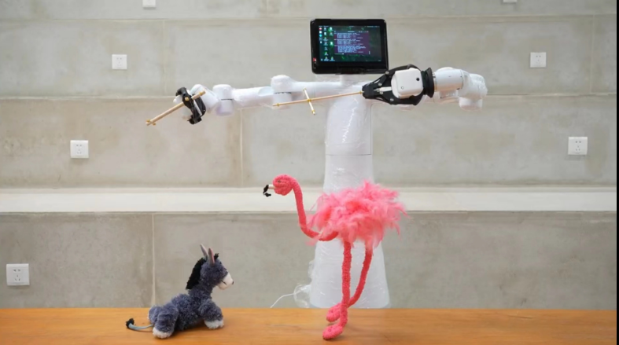
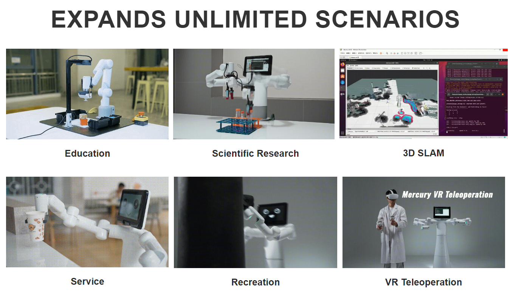

# 1 Product Overview

## Product Introduction

The Mercury X1 is a wheeled dual-arm humanoid robot designed for embodied intelligence applications. It features 19 degrees of freedom and is composed of the Mercury B1 dual-arm robot and a high-performance mobile base. The entire machine is equipped with the newly developed Liyuan series harmonic modules. The new modular design includes electromagnetic brake modules and hollow wiring. It has characteristics such as high precision, high inertia, and low weight. It is also equipped with the NVIDIA Jetson Xavier main control, working in coordination with four independent sub-controls. The mobile base is equipped with high-performance LiDAR, ultrasonic sensors, and 2D vision for rich perception; it uses direct drive motors with a maximum running speed of 1.2m/s; a maximum climbing height of 2CM; and a maximum climbing angle of 15 degrees. The entire machine has a maximum battery life of up to 8 hours, meeting the needs of personal and commercial applications.

| Feature | Description |
| --- | --- |
| Name | Mercury X1 |
| Type | Wheeled dual-arm humanoid robot |
| Degrees of Freedom | 19 degrees of freedom |
| Composition | Mercury B1 dual-arm robot + high-performance mobile base |
| Battery Life | Up to 8 hours |
| Applications | Research, education, service, entertainment, remote operation |

 

## Design Philosophy

The design philosophy of the Mercury X1 wheeled humanoid robot stems from a deep understanding of the needs in the current fields of technology education and research. The rapid development of high-tech fields such as machine learning and artificial intelligence requires experimental equipment to have not only general functionality but also flexibility and precision. The design aims to meet these complex needs, providing a solution that is both flexible and precise and can adapt to various application scenarios.

| Component | Function |
| --- | --- |
| Harmonic Module | Provides high precision, high inertia, low weight |
| Hollow Wiring | Facilitates maintenance and upgrades |
| NVIDIA Jetson Xavier | Main control working in coordination with sub-controls |
| LiDAR, Ultrasonic Sensors, 2D Vision | Rich perception capabilities |
| Direct Drive Motor | High-performance drive, maximum speed 1.2m/s |

## Design Goals

| Design Goal | Description | Application Scenarios and Features |
| --- | --- | --- |
| **General Multi-Functional Platform** | The Mercury X1 wheeled humanoid robot is suitable for various application scenarios such as education, research, and commercial display. | Its multiple degrees of freedom and mobile navigation support complex motion control in various work environments, such as precise positioning and path planning. |
| **Support for Research and Education** | The Mercury X1 wheeled humanoid robot is particularly suitable for machine learning and artificial intelligence research, capable of performing high-precision experiments and technical demonstrations. | Supports end-to-end data training and reproduction, as well as basic visual tasks, making it an ideal device in laboratories. |
| **Programmability and Expandability** | The highly programmable nature of the Mercury X1 wheeled humanoid robot allows users to customize and program according to emerging technologies to meet future technological needs. | Through user-customized programming, the device can achieve optimized operations and experimental results, meeting the ever-changing needs of research and development. |
| **Technological Innovation and Knowledge Dissemination** | In commercial displays, the Mercury X1 wheeled humanoid robot can serve as a platform to showcase the latest technological achievements, aiming to enhance public understanding and interest in technology and promote the commercialization of technological innovations. | By showcasing and demonstrating the latest technological achievements, it increases public engagement, promotes the dissemination of technological knowledge, and enhances market acceptance of technological products. |

 

## Product Features

| Feature | Advantage |
| --- | --- |
| High-Performance Mobile Base | Strong climbing ability, flexible movement |
| Long Battery Life | Meets long working hours |
| Multi-Perception Capability | Strong environmental adaptability |
| Modular Design | Easy maintenance and upgrades |

## Product Value

| Value | Impact |
| --- | --- |
| Education and Research | Promotes education and research in the field of intelligent robots |
| Commercial Service | Enhances interactivity and efficiency in commercial activities |
| Personal Entertainment | Enriches personal entertainment experience, stimulates creativity |

## Industry Contribution

| Contribution | Description |
| --- | --- |
| Research Tool | Provides an experimental platform for humanoid robot research |
| Educational Resource | Serves as a teaching tool, cultivating talents in robotics technology |
| Service Innovation | Promotes the intelligent transformation of the service industry |

## Product Applications

| Application Scenario | Function |
| --- | --- |
| Research | Dual-arm coordinated control, motion planning |
| Education | Image recognition, robot control teaching |
| Service | Exhibition service, company display |
| Entertainment | Humanoid motion simulation |
| Remote Operation | VR/Aloha remote control |

## 3. Supported Extended Development

The Mercury X1 wheeled humanoid robot is extremely valuable in the fields of education and research, especially in the widely used development environments of Python and ROS (Robot Operating System). These environments provide strong support, making the Mercury series products widely applicable in machine learning, artificial intelligence research, complex motion control, and visual processing tasks.

| | |
| --- | --- |
| **Python** | - Provides standardized robot driver libraries, available for download and installation via PyPI - Supports querying joint angle data, Cartesian coordinate data, etc. - These features make Mercury suitable for basic education and research scenarios, especially in data collection and preliminary robot control |
| **ROS** | - Supports both ROS1 and ROS2 versions, providing RVIZ simulation environment support. - Allows users to display the state information of the robotic arm in real-time, making Mercury suitable for ROS beginners and educational purposes. |
| **Hardware Interface** | - Includes IO, USB, etc., facilitating the connection of various sensors and actuators. |
| **Software Libraries** | - Provides a rich set of open-source libraries and APIs to simplify the development process. |

---

[Next Chapter →](../2-ProductFeature/README.md)
