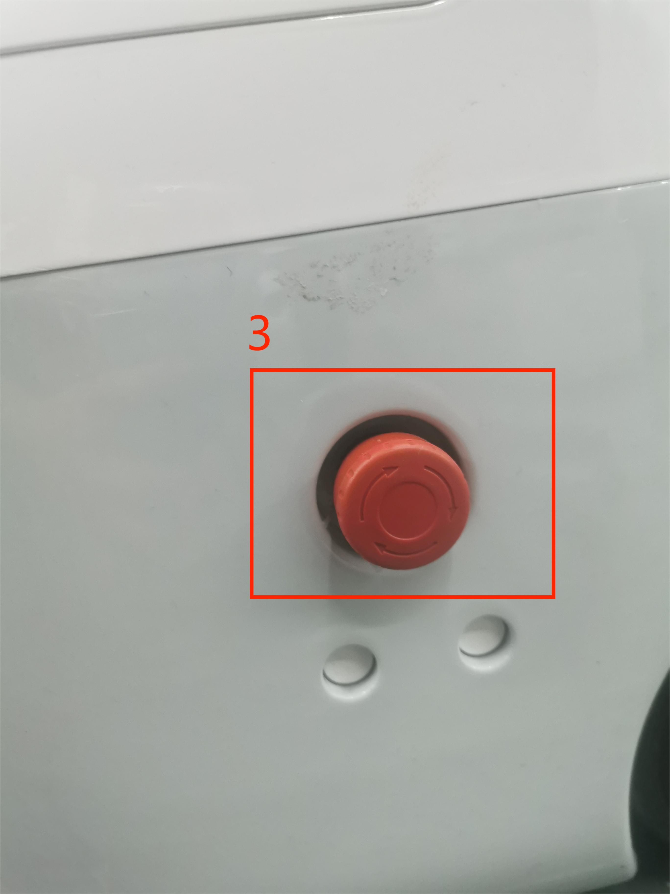

# Electrical Characteristic Parameters

## 1 Overview of the dock interface

 
Figure 1 Front view of the base
 

 
Figure 2 Left view of the base
 

 
Figure 3 Right view of the base
 

 
Figure 4 Interior view of the base
 

## 1.1 Dock Interface Description

| Numbered | Interface | Define | Features | Note |
|:----:|:--------------:|:---------:|:-----------------:|:----------------:|
| 1 | Power input interface | DC24V input | DC24V input |                  |
| 2   | Switch | Power switch | Control the input power on and off | With light (light on) | 
|3   | E-stop interface | STOP      | Emergency stop loop interface |             | 
| 4  | Ethernet port |    |    | 
| 5   | USB3.0       | USB3.0*2   | It can be connected to an external device or a USB flash drive                  |           

#### 1 Power input interface: This interface is connected to the DC24V power adapter interface

#### 2 Power Switch: Control the main power input on and off, when off, the controller is also powered off

#### 3 Emergency stop circuit terminal: connected with the emergency stop button box, it can be used to control the emergency stop of the robot
>**Note**: The emergency stop switch must be connected to the robot in use, and ensure that the emergency stop switch circuit is connected.
 
#### 4 Ethernet 

#### 5 USB3.0 interface: the interface for data connection with serial bus standard 3.0, users can use the USB interface to copy program files, and can also use the USB interface to connect mouse, keyboard and other peripherals
             
## 2 Overview of End Interfaces

 
 Figure 5 Diagram of the end of the left arm
 
 
 

Figure 6 Diagram of the end of the right arm
 

### 2.1 End Interface Description

| Numbered | Interface | Define | Features | Note |
|:------:|:----------------:|:-----------:|:-------------------:|:------------------:|
| 6  |   4pin USB terminal | External interface | Connect the camera |  |
| 7   | M8 Aviation Socket | End Tool IO Interface |  Interact with external devices |                  |

#### 1 As shown in the diagram is the M8 aviation socket I/O diagram, the Mercury X1 robot provides one input and two outputs.

 

The definition of each tool I/O port is shown in the following table, it should be noted that the tool I/O is PNP type in both input and output, and the wiring method is the same as that of the bottom output interface.

| Numbered | Signal | Explanation | M8 line color |
| :------: | :------: | :-----------------------: | :--------------------------: |
| 1      | GND    | DC24V negative | White |
| 2      | OUT1   | Tool output interface 1 | Brown |
| 3      | OUT2   | Tool output interface 2 | Green |
| 4      | 485A   | Reserved, undeveloped | Yellow |
| 5      | 24V    | DC24V positive | Ash |
| 6      | IN1    | Tool input interface 1 | Powder |
| 7      | IN2    | With input interface 2 | Blue |
| 8      | 485B   | Reserved, undeveloped | Purple |

#### 2.1.3 USB terminal: used to connect the camera

---

[← 上一页](../2-ProductFeature/2.3-MechanicalStructureParameter.md)| [下一页 →](../2-ProductFeature/2..5-CoordinateSystem.md)