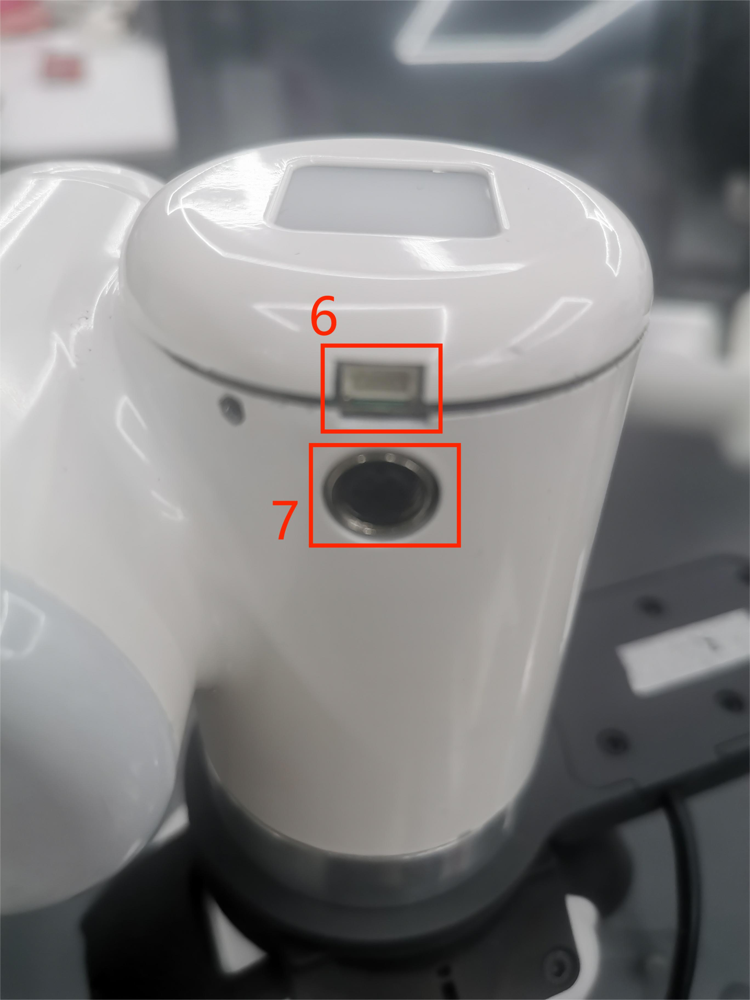

# 电气特性参数

## 1 底座接口总览

Figure 1 底座正视图

Figure 2 底座左视图

Figure 3 底座右视图

Figure 4 底座内部图

## 1.1 底座接口说明
| 编号 | 接口    | 定义 | 功能         | 备注         |
|:----:|:--------------:|:---------:|:-----------------:|:----------------:|
| 1   |电源输入接口 | DC24V输入 | DC24V 输入 |                  |
| 2   | 开关         | 电源开关  | 控制输入电源通断  | 带灯（通电灯亮） | 
|3   | 急停接口 | STOP      | 急停回路接口 |             | 
| 4  | 网口     |    |    | 
| 5   | USB3.0       | USB3.0*2   | 可外接设备或U盘   |                  |                    
#### 1 电源输入接口：本接口与DC24V电源适配器接口连接

#### 2 电源开关：控制总电源输入的通断，关闭时，控制器也断电

#### 3 急停回路端子：与急停按钮盒连接，可用于控制机器人紧急停止
>  **注**: 机器人使用中必须接上急停开关，并确保急停开关回路处于连通状态。
 
#### 4 

#### 5 USB3.0接口：以串口总线标准3.0进行数据连接的接口；用户可以使用USB接口拷贝程序文件，也可以使用USB接口连接鼠标、键盘等外设
             

## 2 末端接口总览

Figure 5 左臂末端图

Figure 5 右臂末端图

## 2.1 末端接口说明
| 编号 | 接口    | 定义 | 功能         | 备注         |
|:------:|:----------------:|:-----------:|:-------------------:|:------------------:|
| 6  |   4pinUSB端子   | 对外接口 | 连接摄像头 |  |
| 7   | M8航空插座 | 末端工具IO接口 |  与外部设备交互 |                  |

#### 1 如图所示是M8航空插座I/O图，Mercury X1机器人提供了一路输入和两路输出。

各个工具I/O端口的定义如下表所示，注意的是，工具I/O无论是输入还是输出都是PNP类型，接线方式同底部输出接口一致。

| 编号 | 信号 | 解释             | 配套M8线颜色 |
| :------: | :------: | :-----------------------: | :--------------------------: |
| 1      | GND    | DC24V 负极      | 白                      |
| 2      | OUT1   | 工具输出接口1 | 褐                      |
| 3      | OUT2   | 工具输出接口2 | 绿                      |
| 4      | 485A   | 预留, 未开发   | 黄                     |
| 5      | 24V    | DC24V 正极         | 灰                        |
| 6      | IN1    | 工具输入接口1  | 粉                       |
| 7      | IN2    | 具输入接口2             | 蓝                      |
| 8      | 485B   | 预留, 未开发   | 紫                    |

#### 2.1.3 USB端子：用于连接摄像头

---

[← 上一页](../2-ProductFeature/2.3-MechanicalStructureParameter.md)| [下一页 →](../2-ProductFeature/2..5-CoordinateSystem.md)