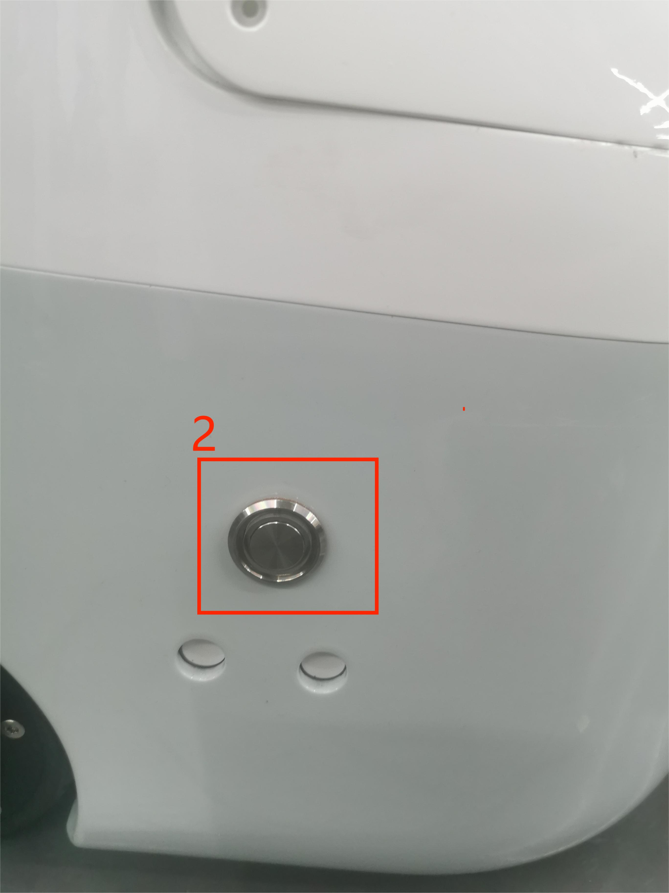
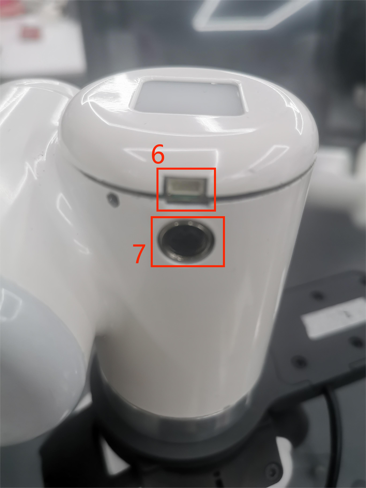

# 机器人参数说明

> 第一章中，我们探讨了产品的卖点及其设计理念，为您提供了对产品高层次理解的全景视角。现在，让我们进入第二章——机器人参数说明。这一章节将是您理解产品技术细节的关键。详细了解这些技术参数，不仅可以帮助您充分认识到我们产品的先进性和实用性，而且还能够确保您能够更有效地利用这些技术来满足您的具体需求。

## 1 机器规格参数

|指标 |参数 |
|:------------: |:---------------------------: |
|中文名 |水星X1轮式双臂人形机器人 |
|名字 |Mercury X1 |
|整机高度 |1.2米 |
|自由度 |19 |
|续航时间 |8小时 |
|机械臂的最大负载 |1公斤 |
|机械臂的可重复性 |±0.05毫米 |
|整机净重 |55KG |
|工作电压 |DC24V/9.2A |
|底盘驱动电机 |高性能直驱电机 |
|最大运行速度 |1.2米/秒 |
|最大爬升角 |15° |
|存储空间 |15升 |
|主控 |6 核 Arm v8.2 64 位 CPU，384 核 Volta™ GPU |
|掌握计算能力 |21 TOPS|
|底座 CPU |4 核 ARM Cortex-A57 CPU |
|底座 GPU |128 个 NVIDIA CUDA® 核心 |
|屏幕|9英寸触摸屏 |
|传感器| 激光雷达、超声波雷达、2D 视觉 |
|3D相机| 奥比中子 Deeyea |
|麦克风| 线性4麦克风，5米180°拾音 |
|IO| 24V 6 输入，6 输出 2A |
|通讯方式|CAN总线/WIFI/网口/蓝牙/USB/串口|

## 2 软件基本功能支持

| 功能/开发环境 | 使用情况 |
| :------------: | :--------: |
| 自由移动 | 支持 |
| 关节运动 | 支持 |
| 笛卡尔运动 | 支持 |
| 轨迹录制 | 支持 |
| 无线控制 | 支持 |
| 紧急停止 | 支持 |
| Windows      | 支持 |
| Linux        | 支持 |
| MAC          | 支持 |
| ROS 1        | 支持 |
| Python       | 支持 |
| C++          | 支持 |
| C#           | 支持 |
| JavaScript   | 支持 |
| myblockly    | 支持 |
| Arduino      | 支持 |
| mystudio     | 支持 |
| 串口控制协议 | 支持 |
| TCP/IP       | 支持 |
| MODBUS       | 支持 |

# 3 控制核心参数

<!--  -->

### 主控制器规格表

| 指标            | 参数         |
| :---------------: | :----------------: |
| 主控     | Jetson Xavier       |
| 主控型号 | Jetson Xavier NX           |
| CPU             | 6 核 NVIDIA Carmel ARM®v8.2 64 位 CPU   6MB L2 + 4MB L3 |
| GPU           | 搭载48个Tensor核心的384核NVIDIA Volta™ GPU |
| AI 性能       | 21 TOPS        |
| 存储        | 16 GB eMMC 5.1         |
| CSI 摄像头      | 2个CSI摄像头 |
| 网络     | 10/100/1000 BASE-T以太网|
| USB 接口    | 1 个 USB 3.2 2.0 (10 Gbps)   2 个 USB 2.0 接口|
| 其他 I/O  | 2个UART串口|

### 左臂主控制器规格表

| 指标            | 参数         |
| :---------------: | :----------------: |
| 主控     | 左臂主控      |
| 主控型号 | ESP32           |
| 核心参数 | 240MHz dual core.   600 DMIPS, 520KB SRAM.   Wi-Fi, dual mode Bluetooth |
| 辅控Flash | 4MB                |
| LED显示 | 5X5 RGB |

### 右臂主控制器规格表

| 指标            | 参数         |
| :---------------: | :----------------: |
| 主控     | 右臂主控      |
| 主控型号 | ESP32           |
| 核心参数 | 240MHz dual core.   600 DMIPS, 520KB SRAM.   Wi-Fi, dual mode Bluetooth |
| 辅控Flash | 4MB                |
| LED显示 | 5X5 RGB |

### 辅控制器规格表

| 指标            | 参数          |
| :--------------: | :----------------: |
| 辅控 | Jetson Nano          |
| 辅控型号 | Jetson Nano 4G       |
| AI Performance | 472 GFLOPS |
| GPU | 128-core NVIDIA Maxwell™ architecture GPU              |
| GPU Max Frequency | 921MHz |
| CPU | Quad-core ARM® Cortex®-A57 MPCore processor |
| CPU Max Frequency| 1.43GHz           |
| Memory | 4GB 64-bit LPDDR4
| 25.6GB/s|
| CSI Camera | 1 个 CSI Camera        |
| USB* | 1x USB3.0(5 Gbps) 2x  USB 2.0   |
| Mechanical |69.6mmx45mm 260-pin SO-DIMM connector |

---

# 4 结构尺寸参数

> 本章以毫米为距离单位，以度为角度单位。

## 产品尺寸及工作空间
  选择机器人安装位置时，必须考虑机器人正上方和正下方的圆柱体空间，尽可能避免将工具移向圆柱体空间。因为这样会造成工具运动较慢时，关节却转动过快，从而导致机器人工作效率低下，风险评估难以进行。

<!--  -->
<!-- 图2.3.1 产品尺寸 -->

<!--    -->
<!-- 图2.3.2 产品工作空间 -->
            

<!-- ## 2 底座安装尺寸 -->

<!--  -->
<!-- 图2.3.3 底座安装尺寸 -->

## 双臂末端法兰尺寸

 
图2.3.4 末端尺寸

# 5 电气特性参数

## 底座接口总览

 
Figure 1 底座正视图
 

 
Figure 2 底座左视图
 

 
Figure 3 底座右视图
 

 
Figure 4 底座内部图
 

## 底座接口说明

| 编号 | 接口    | 定义 | 功能         | 备注         |
|:----:|:--------------:|:---------:|:-----------------:|:----------------:|
| 1   |电源输入接口 | DC24V输入 | DC24V 输入 |                  |
| 2   | 开关         | 电源开关  | 控制输入电源通断  | 带灯（通电灯亮） | 
| 3   | 急停接口 | STOP      | 急停回路接口 |             | 
| 4  | 网口     |    |    |   |
| 5   | USB3.0       | USB3.0*2   | 可外接设备或U盘   |                  |    
 

#### 1 电源输入接口：本接口与DC24V电源适配器接口连接

#### 2 电源开关：控制总电源输入的通断，关闭时，控制器也断电

#### 3 急停回路端子：与急停按钮盒连接，可用于控制机器人紧急停止
>  **注**: 机器人使用中必须接上急停开关，并确保急停开关回路处于连通状态。
 
#### 4 以太网

#### 5 USB3.0接口：以串口总线标准3.0进行数据连接的接口；用户可以使用USB接口拷贝程序文件，也可以使用USB接口连接鼠标、键盘等外设
             

## 末端接口总览

 
Figure 5 左臂末端图
 

 
Figure 6 右臂末端图
 

## 末端接口说明
| 编号 | 接口    | 定义 | 功能         | 备注         |
|:------:|:----------------:|:-----------:|:-------------------:|:------------------:|
| 6  |   4pinUSB端子   | 对外接口 | 连接摄像头 |  |
| 7   | M8航空插座 | 末端工具IO接口 |  与外部设备交互 |                  |

#### 如图所示是M8航空插座I/O图，Mercury X1机器人提供了一路输入和两路输出。

 
各个工具I/O端口的定义如下表所示，注意的是，工具I/O无论是输入还是输出都是PNP类型，接线方式同底部输出接口一致。

| 编号 | 信号 | 解释             | 配套M8线颜色 |
| :------: | :------: | :-----------------------: | :--------------------------: |
| 1      | GND    | DC24V 负极      | 白                      |
| 2      | OUT1   | 工具输出接口1 | 褐                      |
| 3      | OUT2   | 工具输出接口2 | 绿                      |
| 4      | 485A   | 预留, 未开发   | 黄                     |
| 5      | 24V    | DC24V 正极         | 灰                        |
| 6      | IN1    | 工具输入接口1  | 粉                       |
| 7      | IN2    | 具输入接口2             | 蓝                      |
| 8      | 485B   | 预留, 未开发   | 紫                    |

#### USB端子：用于连接摄像头

如果您已经阅读了本章的所有内容，可以继续阅读下一章。

[← 上一章](../1-ProductIntroduction/README.md) | [下一章 →](../3-UserNotes/README.md)