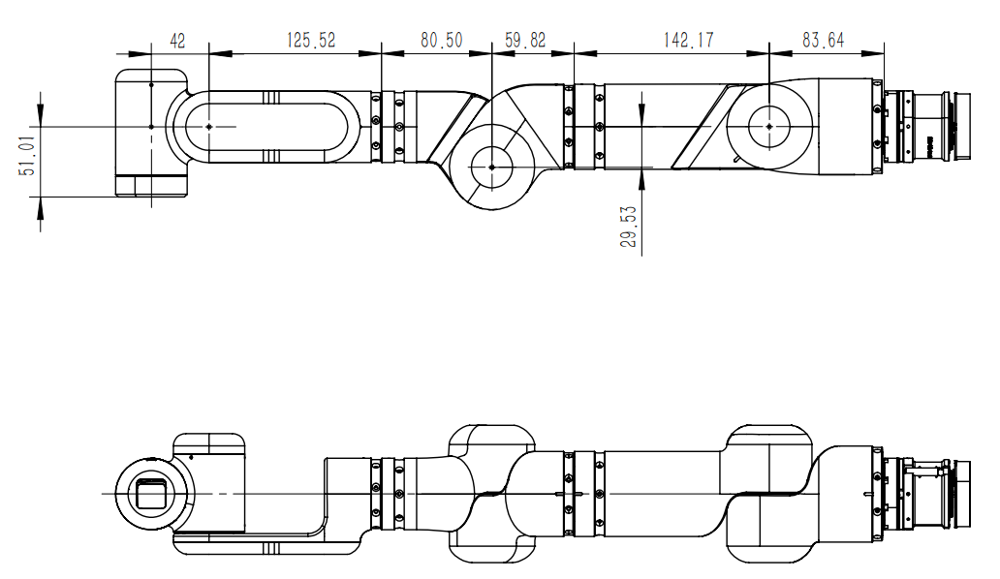
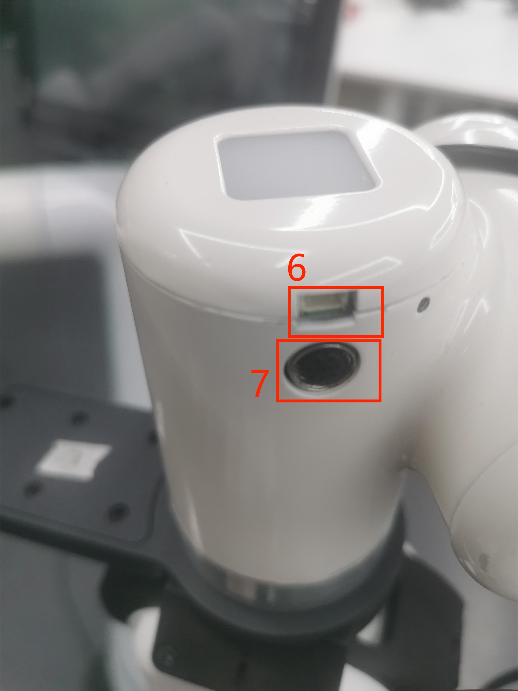

# Robot Parameter Description

> In Chapter 1, we explored the product's selling points and design philosophy, providing you with a panoramic view of the product's high-level understanding. Now, let's move on to Chapter 2 - Robot Parameter Description. This chapter is crucial for you to understand the technical details of the product. Understanding these technical parameters in detail will not only help you fully appreciate the advanced nature and practicality of our product but also ensure that you can effectively utilize these technologies to meet your specific needs.

## 1 Machine Specifications

| Product Model | Mercury X1 |
|:------------: |:---------------------------: |
| Product Height | 1.18m |
| Working Voltage | 24V |
| Degree of Freedom | 19DOF |
| Battery life | 8 hours |
| Maximum Payload | 1KG |
| Net weight | 55KG |
| Repeatability | ± 0.05mm |
| Drive Motor | High performance direct drive motors |
| Maximum Operating Speed | 1.2m/s |
| Maximum Climbing Angle | 15° |
| Storage Space | 15L |
| Main Controller GPU | 6-Core Arm v8.2 64-bit CPU，384-Core Volta™ GPU |
| Computing Power | 21 TOPS |
| Main Controller CPU | 4-Core ARM Cortex-A57 CPU |
| Mobile Base Controller | 128 NVIDIA CUDA® cores |
| Screen | 9-inch Touching Screen |
| Mobile Sensors | LIDAR, Ultrasonic Radar, 2D Vision |
| 3D Camera | Orbbec Deeyea |
| Microphone | Line array 4 microphones，5m 180° pickup |
| IO | 24V 6 Input, 6 Output |
| Communication | CAN Bus/WIFI/Network port/Bluetooth/USB serial port |

## 2 Basic Software Function Support

| Function/Development Environment | Usage |
| :------------: | :--------: |
| Free Movement | Supported |
| Joint Movement | Supported |
| Cartesian Movement | Supported |
| Trajectory Recording | Supported |
| Wireless Control | Supported |
| Emergency Stop | Supported |
| Windows | Supported |
| Linux | Supported |
| MAC | Supported |
| ROS 1 | Supported |
| Python | Supported |
| C++ | Supported |
| C# | Supported |
| JavaScript | Supported |
| myblockly | Supported |
| Arduino | Supported |
| mystudio | Supported |
| Serial Control Protocol | Supported |
| TCP/IP | Supported |
| MODBUS | Supported |

# 3 Core Control Parameters

<!--  -->

### Main Controller Specifications

| Indicator | Parameter |
| :---------------: | :----------------: |
| Main Control | Jetson Xavier |
| Main Control Model | Jetson Xavier NX |
| CPU | 6-core NVIDIA Carmel ARM®v8.2 64-bit CPU   6MB L2 + 4MB L3 |
| GPU | 384-core NVIDIA Volta™ GPU with 48 Tensor cores |
| AI Performance | 21 TOPS |
| Storage | 16 GB eMMC 5.1 |
| CSI Camera | 2 CSI cameras |
| Network | 10/100/1000 BASE-T Ethernet |
| USB Interface | 1 USB 3.2 2.0 (10 Gbps)   2 USB 2.0 interfaces |
| Other I/O | 2 UART serial ports |

### Left & Right Arm Sub Controller Specifications

| Indicator | Parameter |
| :---------------: | :----------------: |
| Sub Control | Left & Right Arm Sub Control |
| Sub Control Model | ESP32 |
| Core Parameters | 240MHz dual core.   600 DMIPS, 520KB SRAM.   Wi-Fi, dual mode Bluetooth |
| Sub-Control Flash | 4MB |
| LED Display | 5X5 RGB |

# 4 Structural Dimensions

> This chapter uses millimeters as the unit of distance and degrees as the unit of angle.

## Product Dimensions and Workspace
When selecting the installation location for the robot, the cylindrical space directly above and below the robot must be considered. Avoid moving tools into the cylindrical space as much as possible. This is because it can cause the joints to rotate too quickly when the tool moves slowly, resulting in low work efficiency and difficult risk assessment.

<!--  -->
<!-- Figure 2.3.1 Product Dimensions -->

<!--    -->
<!-- Figure 2.3.2 Product Workspace -->

<!-- ## 2 Chassis Installation Dimensions -->

<!--  -->
<!-- Figure 2.3.3 Chassis Installation Dimensions -->

## Dual Arm End Flange Dimensions

 
Figure 2.4.1 End Dimensions

## DH value

 
Figure2.4.2 DH value

## Arm section

 
Figure2.4.3 Arm section

# 5 Electrical Characteristics

## Chassis Interface Overview

 
Figure 1 Chassis Front View
 

 
Figure 2 Chassis Left View
 

 
Figure 3 Chassis Right View
 

 
Figure 4 Chassis Internal View
 

## Chassis Interface Description

| Number | Interface | Definition | Function | Remarks |
|:----:|:--------------:|:---------:|:-----------------:|:----------------:|
| 1 | Power Input Interface | DC24V Input | DC24V Input | |
| 2 | Switch | Power Switch | Control input power on/off | With light (lights up when powered) |
| 3 | Emergency Stop Interface | STOP | Emergency stop circuit interface | |
| 4 | Ethernet Port | | | |
| 5 | USB3.0 | USB3.0*2 | Can connect external devices or USB drives | |
 

#### 1 Power Input Interface: This interface is connected to the DC24V power adapter interface

#### 2 Power Switch: Controls the on/off of the main power input, when turned off, the controller is also powered off

#### 3 Emergency Stop Circuit Terminal: Connected to the emergency stop button box, can be used to control the robot emergency stop
> **Note**: The emergency stop switch must be connected during robot use, and ensure that the emergency stop switch circuit is in a connected state.

#### 4 Ethernet

#### 5 USB3.0 Interface: A data connection interface using the serial bus standard 3.0; users can use the USB interface to copy program files, or connect peripherals such as a mouse and keyboard

## End Interface Overview

 
Figure 5 Left Arm End View
 

 
Figure 6 Right Arm End View
 

## End Interface Description
| Number | Interface | Definition | Function | Remarks |
|:------:|:----------------:|:-----------:|:-------------------:|:------------------:|
| 6 | 4-pin USB Terminal | External Interface | Connects to camera | |
| 7 | M8 Aviation Socket | End Tool IO Interface | Interacts with external devices | |

#### As shown in the figure, the M8 aviation socket I/O diagram, the Mercury X1 robot provides one input and two outputs.

 
The definitions of each tool I/O port are shown in the table below. Note that the tool I/O, whether input or output, is of PNP type, and the wiring method is the same as the bottom output interface.

| Number | Signal | Explanation | Matching M8 Wire Color |
| :------: | :------: | :-----------------------: | :--------------------------: |
| 1 | GND | DC24V Negative | White |
| 2 | OUT1 | Tool Output Interface 1 | Brown |
| 3 | OUT2 | Tool Output Interface 2 | Green |
| 4 | 485A | Reserved, Not Developed | Yellow |
| 5 | 24V | DC24V Positive | Gray |
| 6 | IN1 | Tool Input Interface 1 | Pink |
| 7 | IN2 | Tool Input Interface 2 | Blue |
| 8 | 485B | Reserved, Not Developed | Purple |

#### USB Terminal: Used to connect to the camera

If you have read all the content of this chapter, you can continue to the next chapter.

[← Previous Chapter](../1-ProductIntroduction/README.md) | [Next Chapter →](../3-UserNotes/README.md)