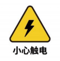
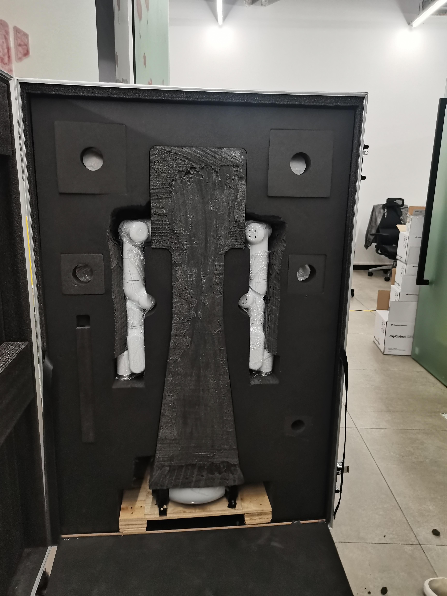

# 用户须知

 <br>

> 本章节是使用本产品的每一位用户必须仔细阅读的重要部分。它涵盖了关于产品使用、运输、储存及维护的关键须知，旨在确保用户在操作产品时的安全性和效率。此外，本章节也详细说明了因未遵循这些指南而可能导致的产品故障或损害的责任划分。

## 1 安全须知

### 概要

  本章详细介绍了对大象机器人进行安装、维护和修理工作的人员的一般安全信息。在搬运、安装、使用前，请仔细阅读并理解本章内容及注意事项。

### 危险识别

 协作机器人的安全性基于机器人的正确配置和使用。此外，即使遵守了所有安全说明，操作员也可能会造成伤害或损坏。因此，了解机器人使用的安全风险以预防它们非常重要。

 表1-1至表3列出了机器人使用过程中可能出现的常见安全风险：

<center>表1-1 风险等级 安全风险</center>

|        |
| ---------------------------------------------------------------------- |
| 1 因机器人操作不当造成的人身伤害或机器人损坏。 |
| 2 如果机器人没有按照要求固定，例如螺丝缺失或螺丝不紧，或者底座的锁定能力不足以支撑机器人高速移动，机器人就会翻倒，导致人身伤害或机器人损坏。 |
| 3 由于安全功能配置不正确或缺乏安全防护工具，导致机器人安全功能未能发挥作用。|

<center>表1-2 安全风险提示</center>

|                |
| ------------------------------------------------------------------------------- |
| 1 调试程序时，不要停留在机器人的运动范围内。安全配置不当可能无法避免碰撞，造成人身伤害。 |
| 2 机器人与其他设备之间的连接可能会带来新的危险，需要进行全面的风险评估。 |
| 3 小心工作环境中的其他设备或机器人末端执行器等尖锐表面造成的划伤和刺伤。 |
| 4 机器人是精密机器；踩到它们可能会造成损坏。运输过程中放置​​不当可能会导致振动，影响内部零件并造成损坏。因此，请确保在所有情况下的稳定性和机械结构完整性。 |
| 5 如果在机器人断电前（夹紧不牢固时）未移除被夹物，可能会导致末端执行器损坏或被夹物因断电而掉落受伤等危险。 |
| 6 存在机器人意外移动的风险。在任何情况下都不要站在机器人的任何轴下！ |
| 7 与普通机械设备相比，机器人具有更多的自由度和更大的运动范围。未能保持在运动范围内可能会导致意外碰撞。 |

<center>表1-3 可能导致触电的安全隐患</center>

|  |
| ----------------------------------------------------------------- |
| 1 使用非原装电缆可能会产生未知的危险。 |
| 2 电气设备接触液体可能引起漏电危险。 |
| 3 电气连接错误可能会导致触电。 |
| 4 更换前请务必关闭控制器及相关设备的电源并拔下电源插头。如果带电进行操作，可能会导致触电或故障。 |

### 安全注意事项

**使用机械手时应遵守以下安全规则：**

- 机械臂属于带电设备。非专业人员不得随意改变电路，否则可能对设备或人体造成损害。
- 操作机械臂时，请遵守当地法律法规。本手册中描述的安全注意事项和危险、警告和注意事项仅是对当地安全法规的补充。
- 请在规定的环境下使用机械臂。超过机械臂的规格和负载条件会缩短产品的使用寿命，甚至损坏设备。
- 无论如何，安装、操作和维护 mercury 手臂的人员必须接受有关安全预防措施以及操作和维护机器人的正确方法的严格培训。
- 无论如何，请勿在潮湿环境中长时间使用本产品。本产品为精密电子元件，长期处于潮湿环境中会损坏设备。
- 无论如何，请勿在潮湿环境中长时间使用本产品。本产品为精密电子元件，长期处于潮湿环境中会损坏设备。
- 高腐蚀性清洁不适合清洁机械臂，阳极氧化部件不适合浸泡清洁。
- 不知不觉中，请勿在未安装底座的情况下使用设备，以免损坏设备或发生事故，应在没有障碍物的固定环境中使用设备。
- 请勿使用其他电源适配器供电。如果因使用非标准适配器而导致设备损坏，则不包含售后服务。
- 请勿拆卸、拆解或拧开机械手的螺钉或外壳。若自行拆卸，则不提供保修服务。
- 未经专业培训的人员不得擅自修理故障产品和拆卸机械臂。如果产品出现故障，请及时联系mercury技术支持工程师。
- 如果产品被丢弃，请遵守相关法律，妥善处理工业废物，保护环境。
- 孩子在某个时刻使用设备，迫使某人监视该过程并在完成后将其关闭。
- 机器人运动时，请勿将手伸入机器人手臂的运动范围内，以免发生碰撞。
- 严禁更改、拆除或修改机械手及相关设备的铭牌、说明、图标和标志。
- 请小心搬运和安装。按照包装箱上的说明轻轻放好机器人，并按照箭头方向正确放置。否则，机器可能会损坏。

- **请勿从 Atom 终端刻录其他产品驱动程序，或使用非官方建议刻录固件。如果因用户烧录其他固件而导致设备损坏，则不属于售后服务范围。**
- 电源规格：**使用官方电源**
- USB Type-C 使用规范：**不要连接到电源板**

**如果您对本手册内容有任何疑问或建议，请登录大象机器人官方网站并提交相关信息：**

https://www.elephantrobotics.com

**请不要将机械臂用于以下用途：**

- 生命攸关的应用中的医疗保健成本。
- 购买公共汽车可能会导致环境爆炸。
- 四旬斋直接使用，无需进行风险评估。
- 使用低级别安全功能的成本。
- Lo-fi不符合机器人使用性能参数。

### 免责声明

请在使用产品前仔细阅读并理解以下免责声明：

- **安全使用：** 本产品专为特定应用场景而设计。确保在使用过程中遵循所有安全准则和操作手册。用户应接受有关产品使用的适当培训，并了解并遵守所有相关的安全法规。

- **责任限制：** 对于因使用或误用产品或与产品相关的任何事项而导致的任何直接、间接、偶然、特殊或后果性损害，制造商概不负责。本免责声明不涵盖或排除法律不允许排除的责任。

- **技术支持：** 请在安装和使用过程中仔细阅读产品文档，必要时寻求制造商的技术支持。有关技术支持问题，请参阅厂家提供的官方文档或联系相关支持渠道。

- **软件更新：** 制造商可能会提供产品固件或软件的更新。用户应定期检查并应用这些更新，以确保产品性能和安全性。

- **定期维护：** 用户应按照制造商提供的定期维护指南检查和维护产品。定期维护和检查有助于确保产品的长期性能。

- **定制和修改：** 未经制造商明确许可，不得定制、修改或变更产品。任何未经授权的修改都可能导致产品保修失效，并可能对安全和性能产生不可预测的影响。

- **法律合规性：** 用户应确保其使用符合所有适用的法律和法规。在某些地区，产品的使用可能受到特定法规的限制。

使用水星X1轮式双臂人形机器人，即表示您同意并接受这些免责声明。制造商保留更改产品规格、功能和免责声明的权利，恕不另行通知。

## 2 运输与保存

### 物流运输要求


|      |    |
|  ----  | ----  |
| 温度  | 0°C~50°C |
| 相对湿度  | 20%~70% |
| 运输时的方向| 机器人头部朝上，双臂垂下 |
| 运输时的外部条件  | 外部使用木架固定，防止挤压 |
| 木架尺寸| 57\*57*120 |

 <center>

<br>内部包装</center>

<center>

<br>外部包装</center>


### 2 设备储藏
|      |    |
|  ----  | :----  |
| 温度  | 0°C~50°C |
| 相对湿度  | 20%~70% |
| 运输时的方向| 机器人头部朝上，双臂垂下 |
| 叠压要求  | 不可叠压 |
| 储藏环境| 室内 |
| 其他环境要求| - 远离灰尘、油烟、盐分、铁屑等。 <br>- 远离易燃性、腐蚀性液体与气体。<br>- 不得与水接触。<br>- 不传递冲击与振动等。<br>- 远离强电磁干扰源。|

## 3 维护和保养
&emsp;&emsp;作为一家机器人制造商，我们重视确保客户能够正确、安全地维护和升级他们的机器人设备。为此，我们提供以下详细的维护和保养指南，包括常见维护项目及维修或升级硬件的部分，请您认真阅读。
### 常见维护项目及推荐周期
|  维护项目    |   描述 |推荐周期 |
|  :-----  | :-----  | :-----  |
| 视觉检查| 检查机器人有无明显的损坏、异物堆积或磨损 |日常 |
| 结构清洁  | 使用干净、干燥的布料清洁机器人结构部件，避免水分和侵蚀性清洁剂 |日常|
| 紧固件检查| 检查并紧固所有螺栓和连接件 |日常|
| 润滑  | 对关节和移动部件进行润滑，使用制造商推荐的润滑油 |每3个月|
| 电缆和接线检查| 检查电缆和接线，确保无损坏或磨损 |每月|
| 电气连接检查| 确保所有电气连接牢固，无腐蚀或损坏|每月|
| 软件更新| 检查并更新控制软件和应用程序 |每次有更新时|
| 软件数据备份| 定期备份关键软件配置和数据|每季度|
| 固件更新| 定期检查并更新固件，以获取最新的功能和安全补丁|每次有更新时|
| 传感器和器件检查| 检查传感器和其他关键器件，确保正常工作|每月|
| 紧急停止功能测试| 定期测试紧急停止功能，确保其可靠性|每月|
| 环境条件监控| 监控工作环境的温度、湿度、灰尘等，确保符合机器人的操作规格。|持续监控|
| 安全配置复查| 定期检查和确认机器人的安全配置，如限速和工作范围设定|每月|
| 预防性维护计划执行| 按制造商的维护计划执行定期检查和维护|按制造商指南|

### 独立更改机器人硬件的指南
&emsp;&emsp;我们理解客户可能会有自行升级或维修机器人硬件的需求。在进行任何升级操作之前，请务必详细阅读产品的相关参数，并与我们的官方人员确认是否被允许进行此类操作。未经官方允许的操作可能导致产品故障，且不在保修范围内。

#### 物料要求
&emsp;&emsp;官方制造或推荐的物料：所有维修和升级所需的配件和组件必须是由我们官方制造或明确推荐的。这包括但不限于电子组件、传感器、电机、连接件和任何其他可更换部件。<br>
&emsp;&emsp;物料获取：客户可通过我们的官方渠道购买所需的维修和升级物料。这确保了配件的质量和兼容性。

### 维修或升级流程
&emsp;&emsp;客户自行维修：客户应负责完成维修工作。我们将提供详细的维修指导和手册，以指导客户完成维修步骤。<br>
&emsp;&emsp;遵循官方指导：维修操作应严格遵循我们提供的官方指导。任何偏离官方指导的操作都可能导致设备损坏。<br>

#### 责任和保修政策
##### 责任划分：
&emsp;&emsp;制造商：提供维修和升级的官方指导、官方制造或推荐的物料，并处理由制造缺陷导致的问题。<br>
&emsp;&emsp;客户：负责按照官方指导完成维修，使用官方配件。<br>

##### 保修政策：
&emsp;&emsp;保修有效：只有当维修操作完全遵循我们的指导，且使用官方配件时，保修才有效。<br>
&emsp;&emsp;保修无效：若客户未按官方指导操作，或使用非官方配件进行维修或升级，导致的任何损坏都将不在保修范围内。<br>

#### 注意事项
&emsp;&emsp;安全第一：在进行任何维修或升级操作前，请确保遵循所有安全指南，包括断电和使用适当的防护装备。<br>
&emsp;&emsp;技术支持：如在维修过程中遇到问题，建议停止操作并联系我们的技术支持团队寻求帮助。<br>
&emsp;&emsp;我们强烈建议客户严格遵循这些指南，以确保机器人设备的安全、有效运行。不当的维修操作可能导致设备损坏并影响保修状态。如需进一步的指导或支持，请及时联系我们的专业技术团队。<br>


## 4 常见问题

### 如何优雅地提问

#### 1 在各地提问时，你会发现几种现象：

- 提问后没有得到答复。
- 提的问题过了很久才用人回答。
- 对方老是嫌弃自己太菜。

#### 2 在提问之前，请确保已经研究过该手册。

很多问题会在这个过程中解决，切忌一开始就到 QQ 群、论坛 、issue， 或者邮件随便提问，很多在文档中一开始就说明了的问题可能不会得到社区的及时的回答，节省大家的时间，也为了更好的社区环境，大家共同更好地成长，请互相理解。

#### 3 提问时，尽量做到以下几点，这将大大增加快速解决问题的机会：

##### 要弄清楚发生了什么事，我做了什么，包括：

- 我想实现什么样的效果、什么功能？

- 为了达到这种效果，我是怎么做的，具体过程是怎样的？

- 在实施过程中，出现了什么错误，有什么现象（例如，报告的错误是什么，**完整**的错误内容是什么？）

- 我是否认真看了报错信息，报错信息中是否提示了错误原因和解决方法？

- 根据这些错误信息，仔细想想，我能解决问题吗？

- 搜索文档、issue，以及用搜索引擎能不能搜索到问题的解决方法?

#### 4 如果自己实在解决不了问题，需要请人帮忙，需要考虑：

- 请教谁，在哪里请教，谁会更有几率回答我的问题？以及实时性如何？

- 我应该给他提供什么数据和现象他才能愿意快速帮我解决问题？

  - 提供我的目的（方便让回答者知道你在做什么事情）
  - 提供完整的实施过程，以及过程中出现的现象（方便回答者跟着你的流程去做一遍，即问题复现）
  - 给出错误的地方，指明哪里出现的现象或结果和自己预期的不一样！（让回答者知道，哪里没达到预期）
  - 提供出现的错误信息，需要完整，尽可能更多地截图，更多的日志，千万别小气地截一张小图，或者之给出日志的一部分（因为回答者可能很久没做这件事情了，忘记了一些细节，需要靠截图和完整日志来快速回忆起来;而且根据详细的日志可以快速定位到问题处在哪里）

- 怎么提问态度显得比较诚恳，就算我再小白，大家也愿意回答

#### 5 提问模板

提问尽量做到提问优雅，不需要添加多余的语气词，抱怨的词汇，斟酌每一个词和标点符号，站在回答人的角度思考问题，如何让回答的人快速帮助自己解决问题，字数太少描述不清楚，字数太多则让人没有耐心。

#### 6 标题

无论在哪里提问（包括 `QQ 群`），给自己的问题拟定一个 30 个字左右标题，阐明问题的中心思想，包括：

- 问题类别，是问题请教，还是 BUG 提交，还是经验分享等等。让大家在满是文字的屏幕上可以立马定位到你想做什么
- 一句话阐明问题的中心你思想，比如 `运行摄像头示例程序，报错 reset fail，可能是硬件问题`

所以综合后标题可以是这样：

- `【mercury 提问】 运行摄像头示例程序，报错 reset fail，可能是硬件问题吗`

这样的标题尽量**不要**出现:

- `啊啊啊啊啊为什么我的板子又不行了`
- `为什么我的代码不能运行了`
- `为什么我的屏幕黑屏了`
- `【mercury 提问】 收到了开发板，开发板屏幕是红的，一行小字，为什么呢`
- `我运行xxx程序，出了问题`

可以这样问：

- `【mercury 提问】 我的板子在我接反电源后，现在板子无法启动，怎么判断板子哪里烧毁了，如果可以，怎么救活呢`

#### 7 内容

首先站在回答者的角度，如果被问问题:

- 首先要知道对方要做什么，实现什么目标
- 为了实现这个目标，他是参考了哪里的步骤做的
- 实际上采用了哪些具体的步骤，然后在那一步出现了问题，方便我照着他的步骤去尝试复现一下现象。如果这个问题看起来不好解决，又没有复现的步骤，那可能要花很多时间去复现，先放一放先解决其它问题吧
- 具体出现的问题是什么，如果他只说出了问题，我怎么知道他出了什么问题，也许是身体不适？所以这很重要，需要让他说明出问题时的现象，并指明与预期有什么不同，不然我还得去猜去对比和预期有什么不同，解决问题的时长又增加了
- 出问题了，我可能需要他的日志文件，方便我根据日志去看源码等进行分析，不然可能会很难解决问题，那这个问题可以放到后面慢慢看吧

综上，可以这么提问：

- 详细阐明自己的目标，想做什么事情，现象应该是什么样的
- 我有没有参考哪里的文档、代码或者教学
- 如何复现错误：具体怎么做的，每一个步骤写详细，直到问题出现
- 详细阐述错误出现时的现象，以及和期望的相比哪里不一样，需要证明问题确实出现了
- 附带日志文件，以及截图，甚至是视频，日志和截图一定要完整，不要只截取一小部分，回答者可能会从你的完整日志和截图中发现一些你没注意到的问题，这很重要
- 另外，粘贴代码注意格式，别粘贴后显示很乱，无法入目，尽量能复制后直接能运行
- 最后，对解答问题的社区朋友们表达感谢

### 驱动器相关

#### 1 关于python

**问： send_base_coords（[x，y，z，rx，ry，rz]， speed） 此 API 中的参数是什么意思？rx、ry 和 rz 对应于欧拉角什么？欧拉角的旋转顺序是什么？每个参数的取值范围是多少？**

- 答：前面数组中的参数是 mercury X1 末端的坐标，speed 是速度。rx、ry 和 rz 应对应 RPY，即分别对应滚动、俯仰和偏航。欧拉角的阶数是 zyx，zyx 是它自己的坐标。x、y、z的取值范围。为-350\~350，-350\~350，-41\~523.9（取值范围未定义，如果超过该范围，将返回逆运动学无解提示），rx、ry、rz的取值范围为-180~180。

**问：不同版本的机械臂的 python api 是否相同？**

- 答：API 是一样的。

#### 2 关于ROS
**问：您能提供 rviz 模型的文件和编程示例吗？**

- 答：它可以在我们的 github 上找到。
“https://github.com/elephantrobotics/mercury_x1_ros”

**问：为什么使用 ROS 启动 rviz 模型文件时，报错权限“/dev/ttyUSB0”？**

- 答：这是因为没有给出串口权限。您应该在终端中键入 sudo chmod 777 端口名称。
  例如：
  ```
  sudo chmod 777 /dev/ttyUSB0
  ```

**问：为什么在运行 ROS 的滑块控件和模型遵循命令时，错误 \_init_() takes exactly 2 arguments (3 given)？**

- 答：pymercury 库未安装和启动。

**问：使用 ROS 时，为什么打开 rviz 模型后 mercury_X1 角度与模型角度不一致？**

- 答：很有可能mercury_X1的零位没有校准，mercury_X1的零位需要校准。


### 软件问题

#### 关于ROS1

**问:终端切换到~/catkin_ws/src，使用git安装更新mercury_x1_ros时，目标路径“mercury_x1_ros”已经存在。原因是什么?**

- 答:这意味着在~/catkin_ws/src中已经有一个“mercury_x1_ros”包了。需要提前删除，然后重新执行git操作。

**问: rosrun运行时，终端错误提示“could not open port /dev/ttyUSB0: Permission: '/dev/ttyUSB0'”。为什么?**

- 答:串口权限不足。在终端输入“sudo chmod 777 /dev/ttyUSB0”，授予权限。

**问:为什么ROS程序不能在VSCode中运行?**

- 答:由于VSCode终端无法加载到ROS环境中，需要在系统终端中运行。

**问: rosrun运行时，终端提示“无法注册主节点[http://localhost:11311]:主节点可能尚未运行”。我会继续努力的。”原因是什么?**

- 答:运行ROS程序前，需要打开ROS节点，在终端中输入“roscore”。

**问: rosrun运行时，终端错误提示“could not open port /dev/ ttyusb0: No such file or directory: '/dev/ttyUSB1'”。为什么?**

- 答:串口错误。需要确认当前机械臂的实际串口。可以通过` ls /dev/tty* `查看。

**问:在Ubuntu18.04中，' catkin_make '构建代码失败，终端提示' Project 'cv_bridge'指定'/usr/include/opencv'作为包含目录，没有找到。和其他错误信息**

- 答:配置文件中的OpenCV路径与系统实际路径不匹配。你需要使用sudo命令修改配置文件(路径为“/opt/ros/melodic/share/cv_bridge/cmake/cv_bridgeConfig.cmake”)。系统的实际OpenCV路径位于“/usr/include/”路径下。

**问:只需克隆mercury_x1_ros包，然后直接运行rosrun程序。出现诸如“package”mercury_x1_ros“not found”之类的错误或诸如无法找到文件之类的错误?**

- 答:新克隆的mercury_x1_ros需要构建ROS环境编译的代码。终端输入

```
bash
cd ~/catkin_ws/
catkin_make
source devel/ setup.bash
```

#### 关于机械臂控制

**问:给机械臂发送角度或坐标机械臂没有运动**

- 答：使用`get_angles()`读取机械臂的角度，若角度返回为空，则检查机械臂是否上电，使用`power_on()`对机械臂进行上电使能；检查端口号是否使用正确。
若有角度，查看角度是否超出运动范围见表1，如果超出范围，使用`release_all_servos()`放松所有关节（注意关节放松后会下坠，需要接住），对齐1~5、7关节零刻度线，6关节与零刻度线90度垂直。再使用`focus_all_servos()`锁定关节，再使用`set_servo_calibration(1)~set_servo_calibration(7)`依次校准各关节零点，再使用`get_angles()`读取当前关节角度，如返回数据为[0, 0, 0, 0, 0, 90, 0]则为校准成功，否则重复之前的校准步骤。

<center> 表1-1 各关节角度可运动范围</center>

|   关节   | 范围   |
|  :----:  | :----:  |
| J1  | -175 ~ +175 |
| J2  | -65 ~ +115 |
| J3| -175 ~ +175 |
| J4  | -180 ~ +10 |
| J5| -175 ~ +175 |
| J6| -20 ~ + 173 |
| J7| -180 ~ +180 |


**问:摄像头无法打开**

- 答：打开本地相机查看是否可以切换到左右臂摄像头，如有某个摄像头无法查看，则重新拔插USB口或者更换USB口。
若可以切换到左右摄像头，检查摄像头端口是否发生变化(在重启后，端口可能发生变化)

**问:自适应夹爪无法控制**

- 答：查看自适应夹爪的电源指示灯，正常时指示灯应为常亮状态，若指示灯出现闪烁情况，请重新拔插夹爪与机械臂的连接线，指示灯恢复常亮状态则正常。
若指示灯为常亮状态仍无法控制，使用`set_gripper_mode(0)`更改夹爪使用模式。
**问:底座无法移动**

在终端输入
```
roslaunch turn_on_mercury_robot turn_on_mercury_robot.launch
rostopic echo /PowerVoltage
```
查看电池电量，若电量低于21V，底座无法使用，请充电后继续使用


### 硬件问题

#### 1 关于结构

**问:Atom在机械臂中的作用是什么?**

- 答: Atom主要控制机械臂的运动学算法，包括正逆运动学、解选择、加减速、速度同步、多功率插补、坐标转换等。与atom相关的程序还不是开源的。

**问:使用过程中电机自动切断电源。为什么?**

- 答:电机长时间使用有过热保护。这种现象属于正常现象，几分钟后可以继续使用。

#### 2 关于参数

**问:机械臂的速度单位是多少?**

- 答:运行速度为180度/秒。

**问:自适应夹持器可以不完全关闭吗?**

- 答:下巴之间会有一定的间隙，它们并不是完全闭合的。您可以通过增加它们之间的间隔的厚度来调整它。

**问:机械臂末端USB摄像头如何固定?**

- 答:需要用法兰固定，可以单独购买。


如果您有购买意向或任何参数问题，请发送电子邮件至此邮箱。 
[邮箱](sales@elephantrobotics.com) :  "sales@elephantrobotics.com"

如果列出的问题不能帮您解决，您有更多售后问题，请发送邮件至此邮箱。
[邮箱](support@elephantrobotics.com) : "support@elephantrobotics.com"

----
[← 上一章](/2-ProductFeature/README.md#) | [下一章 →](/4-FirstInstallAndUse/README.md)