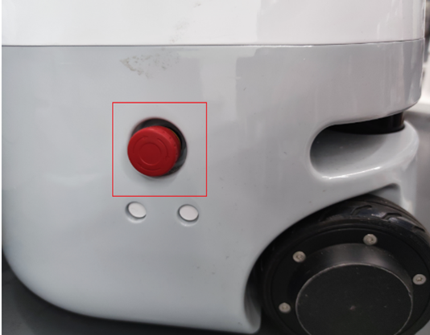

# 1 产品标准列表

## 产品标准清单对照表

|序列号|产品|
| -------------- | ----------------------------- |
| 1 | 水星Mercury X1轮式人形机器人|
| 2 |产品手册|
| 3 |合格证书|
| 4 |使用说明|
| 5 |发货清单|
| 6 |电源(24V)|

**注意:** 包装框到位后，请确认机器人包装完整。如果有任何损失，请及时联系物流公司和您所在地区的供应商。解开包装后，请根据项目列表检查框中的实际内容。

---

# 2 产品开箱指南

## 产品开箱图形指南

**为什么您需要按照以下步骤移出产品**

在本节中，我们强烈建议按照指定的步骤移出产品。这不仅有助于确保产品在运输过程中不会损坏，还可以将意外故障的风险降至最低。请仔细阅读以下图形指南，以确保您的产品在开箱过程中是安全的。

- **1** 检查箱体是否损坏。如有损坏，请及时与您所在地区的物流公司和供应商联系。
- **2** 打开包装盒，取出使用说明、海绵包装盖、水星Mercury X1轮式人形机器人、配套电源、发货清单。
- **3** 在进行下一个步骤之前，请确保每一步都已完成，以防止不必要的损坏或遗漏。

**注意:** 取下产品后，请仔细检查每件物品的外观。请将箱子里的实际项目与项目清单核对一下。
 <center>

<br>开箱图片</center>

---

# 3 开机检测指南

## 外部电缆连接

操作前请仔细阅读 **章节安全说明** ，确保操作安全。同时将电源适配器与底座连接。

将电源适配器连接上机械臂，也可通过内置电源供电，并将机器人移至空旷区域防止碰撞。

 <center>

<br>底座后部电源接口位置</center>
 
 <center>

<br>电源开关位置</center>

<center>

<br>急停开关位置</center>


在按下急停开关后机器人将立即停止运动，复位时需将急停开关顺时针旋转，急停开关将自动弹起，之后可上电恢复控制。

点击电源开关，并确保急停处于复位状态，开始使用机械臂。
<center>

<br>底部LED灯亮起</center>

## 进入开机界面

<center>

<br>屏幕点亮</center>

进入登录界面后输入开机密码**Elephant**

<!-- ## 电源状态显示

确认电源适配器已连接，按下电源开关**启动按钮(圆形)**，则底座的**LED灯闪烁**。 -->


<!-- ## 基本功能检测

操作时请参考[5.1-4机器人信息](/5-BasicApplication/5.1-SystemUsageInstructions/320m5/4.2.4.1-micro_controller.md)章节进行指导。在继续操作之前，请确保按照上述电气连接说明进行操作，并确认设备已安全安装。没有正确连接线缆或固定设备，可能会导致事故。谢谢你的合作。 -->

## 基础功能检测

### 检测双臂是否可以正常运动：<br>
1. 打开终端进入python环境<br>
2. 导入pymycobot包，初始化左右臂并上电<br>
3. 使用get_angle()获取关节角度,若能获取到角度则上电成功<br>

4. 校准零点，再次使用get_angle()获取关节角度，当返回为
[0.0, 0.0, 0.0, 0.0, 0.0, 90.0, 0.0]时零点校准成功<br>
5. 对左右臂进行控制看是否能运动，若成功运动则机械臂正常
<center>

<br>上电后获取关节角度</center>

### 检测移动底座是否可以正常运动：
1. 在终端输入下列指令启动底座控制
```shell
roslaunch turn_on_mercury_robot turn_on_mercury_robot.launch
```

<center>

<br></center>

2. 再打开一个新的终端，输入下列指令启动键盘控制移动底座。根据提示进行按键控制，若小车正常运动则移动底座正常。
```shell
roslaunch mercury_x1_teleop keyboard_teleop.launch
```

### 检测激光雷达是否正常
1. 打开终端输入
```shell
roslaunch turn_on_mercury_robot mapping.launch
```
2. 打开一个新的终端输入
```shell
roslaunch turn_on_mercury_robot cobotx_rviz.launch
```
若自动打开的rviz中有如图白色区域，则激光雷达扫描正常

<center>

<br></center>

----

[← 上一章](../3-UserNotes/README.md) | [下一章 →](/6-SDKDevelopment/README.md)