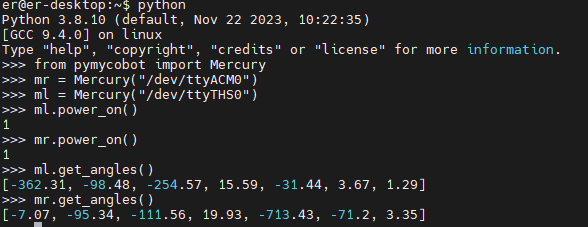

# 1 Product Standard List

## Product Standard Checklist

| Serial Number | Product |
| -------------- | ----------------------------- |
| 1 | Mercury X1 Wheeled Humanoid Robot |
| 2 | Product Manual |
| 3 | Certificate of Qualification |
| 4 | User Instructions |
| 5 | Shipping List |
| 6 | Power Supply (24V) |

**Note:** After the packaging box is in place, please confirm that the robot packaging is intact. If there is any damage, please contact the logistics company and the supplier in your area in time. After unpacking, please check the actual contents in the box against the item list.

---

# 2 Product Unboxing Guide

## Product Unboxing Graphic Guide

**Why You Need to Follow the Steps Below to Remove the Product**

In this section, we strongly recommend following the specified steps to remove the product. This not only helps ensure that the product is not damaged during transportation but also minimizes the risk of accidental failure. Please read the following graphic guide carefully to ensure that your product is safe during the unboxing process.

- **1** Check the box for damage. If there is any damage, please contact the logistics company and the supplier in your area in time.
- **2** Open the packaging box and take out the user instructions, foam packaging cover, Mercury X1 Wheeled Humanoid Robot, matching power supply, and shipping list.
- **3** Before proceeding to the next step, please ensure that each step has been completed to prevent unnecessary damage or omissions.

**Note:** After removing the product, please carefully check the appearance of each item. Please check the actual items in the box against the item list.
 <center>

<br>Unboxing Image</center>

---

# 3 Gripper Camera Installation Guide

<video id="my-video" class="video-js" controls="" preload="auto" width="100%" poster="" data-setup="{&quot;aspectRatio&quot;:&quot;16:9&quot;}">

  <source src="../resources/4-FirstInstallAndUse/image/Mercury夹爪安装.mp4" type="video/mp4">
</video>

# 4 Power-On Detection Guide

## External Cable Connection

Please read the **Chapter Safety Instructions** carefully before operation to ensure safe operation. At the same time, connect the power adapter to the base.

Connect the power adapter to the robotic arm, or power it through the built-in power supply, and move the robot to an open area to prevent collisions.

 <center>

<br>Power Interface Position at the Rear of the Base</center>
 
 <center>

<br>Power Switch Position</center>

<center>

<br>Emergency Stop Switch Position</center>

After pressing the emergency stop switch, the robot will stop moving immediately. To reset, turn the emergency stop switch clockwise, and it will pop up automatically. Then you can power on and resume control.

Click the power switch and ensure that the emergency stop is in the reset state to start using the robotic arm.
<center>

<br>Bottom LED Light On</center>

## Enter the Power-On Interface

<center>

<br>Screen On</center>

Enter the login interface and input the power-on password **Elephant**

<!-- ## Power Status Display

Confirm that the power adapter is connected, press the power switch **start button (round)**, and the base's **LED light flashes**. -->

<!-- ## Basic Function Detection

Please refer to the [5.1-4 Robot Information](/5-BasicApplication/5.1-SystemUsageInstructions/320m5/4.2.4.1-micro_controller.md) chapter for guidance during operation. Before continuing, ensure that the electrical connections are made according to the above instructions and that the equipment is securely installed. Incorrectly connected cables or unsecured equipment may cause accidents. Thank you for your cooperation. -->

## Basic Function Detection

### Check if the Dual Arms Can Move Normally:
1. Open the terminal and enter the Python environment.
2. Import the pymycobot package, initialize the left and right arms, and power on.
3. Use get_angle() to get the joint angles. If the angles can be obtained, the power-on is successful.

4. Calibrate the zero point, and use get_angle() again to get the joint angles. When the return is [0.0, 0.0, 0.0, 0.0, 0.0, 90.0, 0.0], the zero point calibration is successful.
5. Control the left and right arms to see if they can move. If they move successfully, the robotic arm is normal.
<center>

<br>Get Joint Angles After Power-On</center>

### Check if the Mobile Base Can Move Normally:
1. Enter the following command in the terminal to start the base control:
```shell
roslaunch turn_on_mercury_robot turn_on_mercury_robot.launch
```

<center>

<br></center>

2. Open a new terminal and enter the following command to start keyboard control of the mobile base. Follow the prompts to control the keys. If the car moves normally, the mobile base is normal.
```shell
roslaunch mercury_x1_teleop keyboard_teleop.launch
```

### Check if the LiDAR is Normal
1. Open the terminal and enter:
```shell
roslaunch turn_on_mercury_robot mapping.launch
```
2. Open a new terminal and enter:
```shell
roslaunch turn_on_mercury_robot cobotx_rviz.launch
```
If the automatically opened rviz has a white area as shown in the figure, the LiDAR scan is normal.

<center>

<br></center>

----

[← Previous Chapter](../3-UserNotes/README.md) | [Next Chapter →](/6-SDKDevelopment/README.md)