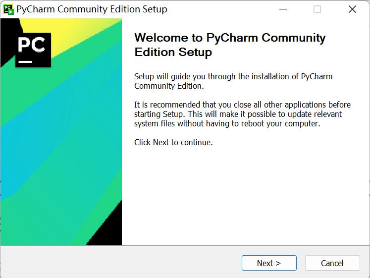
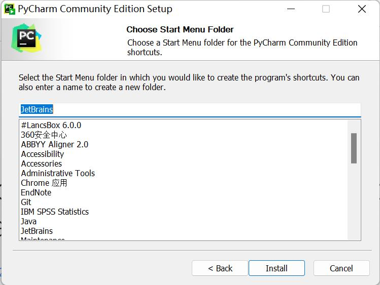

# Environment Configuration

> pymycobot is a Python library developed by Elephant Robot for robot control.

## Linux

Python 3.8.10 is pre-installed on the system, and the `pymycobot` control library is already installed, so users do not need to install it themselves.

### pymycobot Installation

You can install pymycobot by entering the command in the terminal:
````bash
pip install pymycobot
````

### pymycobot Uninstallation

You can uninstall pymycobot by entering the command in the terminal:
````bash
pip uninstall pymycobot
````

### pymycobot Update

You can update pymycobot by entering the command in the terminal:
````bash
pip install pymycobot -U
````

## Windows

### 1.1 Installing Python

> **Note:** Before installation, check the operating system of your PC. Right-click on the "My Computer" icon and select "Properties". Install the corresponding Python version.
>
> 
>
> 

* **Go to http://www.python.org/download/ to download Python.**
* **Click "Download" to start downloading. Check "Add Python 3.10 to PATH". Click "Install Now" to start the installation.**


* **Download and installation complete.**
   


### 1.2 Running Python
Open the Command Prompt window (Win+R, type "cmd" and press "Enter"). Type "Python".

**Successful Installation:**


This indication on the screen means that Python has been successfully installed. The prompt ">>>" indicates the Python interactive environment. If you enter a piece of Python code, you will get the execution result immediately.


**Error Report:**

If you enter an incorrect command, such as "pythonn", the system may report an error.


> **Note:** Generally, this error is caused by insufficient environment configuration. Refer to **1.3 Environment Configuration** to solve the problem.


### 1.3 Environment Variable Configuration
Windows follows the Path environment variable settings to search for **python.exe**. Otherwise, an error will be reported. If you did not check "Add Python 3.9 to PATH" during installation, you need to manually add the path where python.exe is located to the environment variables or re-download Python. Remember to check "Add Python 3.9 to PATH".

Follow these steps to manually add Python to the environment variables.

* Right-click the "My Computer" icon --> Properties -> Advanced system settings -> Environment Variables


* Environment variables include user variables and system variables. For user variables, users can use their downloaded programs through the "cmd" command. Write the absolute path of the target program into the user variables.


* After configuration is complete, open the Command Prompt window (Win+R; type "cmd" and press "Enter"), then type "Python".


### 2 Installing PyCharm

PyCharm is a powerful, cross-platform Python editor. Follow these steps to download and install PyCharm.

Go to **[PyCharm](http://www.jetbrains.com/pycharm/download/#section=windows)** to download PyCharm.

#### 2.1 Download and Installation

Official website view:


It is recommended to install the free version.

* Click "Next":



* Select options according to your needs, then select "Next":


* Click "Install":



* Installation:


* Click "Finish"

   
  


#### 2.2 Creating a New Project

* Click "+Create New Project":

<!--  -->

* `Interpreter` is used to interpret Python programs. Select "Add Interpreter" -> "New" to add a base interpreter.

   

   

* `Location` refers to the location where the Python files are saved. Choose a file to place your program.

   

* Click "Create", and an example will appear:
   <!--  -->

* Right-click the option indicated by the red arrow, then create a new Python file.

   <!--  -->

* Type the name of the new file.

   <!--  -->


### **3 Preparations**

* pymycobot Installation. Enter the command "pip install pymycobot --upgrade --user" through the terminal (Win+R) "cmd".

   ````python
   pip install pymycobot --upgrade --user
   ````

  

   

* Source Code Installation. Open the terminal (Win+R, type `cmd`), then enter the following commands to install.

   ````python
   git clone https://github.com/elephantrobotics/pymycobot.git <your-path>
   #Fill in your installation address in <your-path>, do not choose the current default path.
  
   cd <your-path>/pymycobot
   #Enter the pymycobot folder of the downloaded package.
  
   #Run one of the following commands according to your Python version.
   ＃ install
    python2 setup.py install
   ＃ or
    python3 setup.py install
   ````

* Update pymycobot

````bash
pip install pymycobot --upgrade
````


> **Note:**
>
> 1. If there are no red wavy lines under the code, it means pymycobot has been successfully installed.
> 2. If red wavy lines appear, please manually download pymycobot from **https://github.com/elephantrobotics/pymycobot** and place it in the Python library.
>
> 


## Basic Usage of Python

```python
mr = Mercury('/dev/right_arm')

ml.power_on()
mr.power_on()

print(ml.get_angles())
print(mr.get_angles())
```

----

[← Previous Page](../README.md) | [Next Page →](./6.1.2-ApplicationBasePython.md)