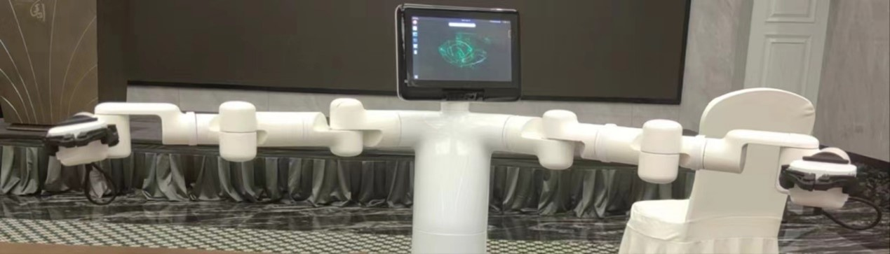
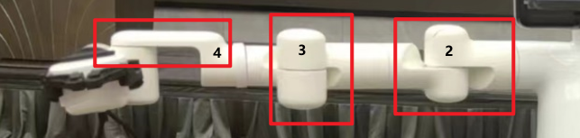

# 7 Robot Usage Scenarios

This chapter presents classic robotic arm usage scenarios to showcase the product's applications in representative settings. This includes typical applications of the Mercury X1 wheeled humanoid robot in various fields, highlighting the product's versatility and applicability. Through these cases, users can gain an in-depth understanding of the robotic arm's flexibility and efficiency in practical applications, providing references for their use in specific scenarios.

- [QR Code Recognition and Grasping](7.1-stag_detect.md)<br>
  The Mercury X1 wheeled humanoid robot's arm is equipped with a 2D camera and gripper to achieve QR code recognition and grasping. The QR code uses stag code, and the stag.detectMarkers function is used to obtain the stag code's camera coordinates. The coordinates are then transformed to the base coordinates using matrix transformation, and the coordinate control function is called for grasping.<br>

- [Spatial Movement Case](7.2-robot_move.md)<br>
  The chassis can be remotely controlled using a keyboard, or the mercury_ros_api library can be used for movement control and navigation of the base.

- [Mobile Grasping Case](7.3-move_and_catch.md)<br>
  This case combines the previous two cases, using navigation to move the Mercury X1 wheeled humanoid robot to a designated location, and then achieving grasping through stag vision recognition.

## Preparations for Using Vision Recognition

**1. Materials and Power-On Preparation**

**1.1 Material Preparation**

Materials needed for vision recognition tracking include:
1) Mercury series robots
2) Vision sensors and stag code accessories
3) Gripper and related accessories

**1.2 Power-On Preparation**

Connect the power adapter to the robotic arm, or use the built-in power supply, and move the robot to an open area to prevent collisions.

 <center>

<br>Power interface at the rear of the base</center>
 
 <center>

<br>Power switch location</center>

<center>

<br>Emergency stop switch location</center>

Pressing the emergency stop switch will immediately stop the robot. To reset, rotate the emergency stop switch clockwise, and it will automatically pop up. Then, power on to resume control.

Click the power switch and ensure the emergency stop is reset to start using the robotic arm.

**2. Mercury System Debugging**

**2.1 Powering On the System**

The robotic arm supports multiple ways to power on. This document only introduces using Python commands to control the power on. Enter the following commands in the Terminal to power on the robot:

    python
    from pymycobot import Mercury
    mr = Mercury("/dev/right_arm")  #connect to Mercury right arm
    ml = Mercury("/dev/left_Arm")  #connect to Mercury left arm
    ml.power_on()	
    mr.power_on()	

Before sending the command, ensure the emergency stop switch is reset. When you hear the **joint brake sound**, it means the power-on is successful! If you do not hear the brake sound, use the following commands to repeatedly power on and off:

First, send the power-off command

    ml.power_off()	
    mr.power_off()	

Wait a few seconds and then send the power-on command

    ml.power_on()	
    mr.power_on()	

**If you still do not hear the brake sound, contact an engineer for assistance.**

**2.2 Robotic Arm Zero Calibration**

Before using the robotic arm, ensure the zero position is correct. You can calibrate the zero position using the following method:

1) Use the relax command to release the joint motors (**Note! After relaxing, hold the joints to prevent the robotic arm from falling and getting damaged!**)

    ml.release_all_servos()
    mr.release_all_servos()

2) Drag the robotic arm back to the zero position



You can determine the zero position through the following details:
 
 

3) Send the command to lock the motors

    ml.focus_all_servos()
    mr.focus_all_servos()
 	
4) Check if the zero position is correct

Enter the command to get the joint angles and query the current position

    ml.get_angles()
    mr.get_angles()

If the returned joint angles are close to [0, 0, 0, 0, 90, 0], the zero position is considered correct.

5) Zero Calibration

If the joint angles read at the zero position differ significantly from [0, 0, 0, 0, 90, 0], calibrate the joint zero position

    for i in range(1,7):
      ml.set_servo_calibration(i)
      mr.set_servo_calibration(i)

After calibration, read the joint information. If the return is [0, 0, 0, 0, 90, 0], the calibration is successful.

    ml.get_angles()
    mr.get_angles()

**2.3 Robotic Arm Movement**

You can verify the robotic arm's movement function using the following methods:

1) Ensure the zero position is correct, then use the return to zero command to control the robotic arm back to the zero position:

    ml.over_limit_return_zero()
    mr.over_limit_return_zero()
 
2) Send the joint movement command to verify if the robotic arm movement is normal

    ml.send_angle(1,20,10)
    mr.send_angle(1,20,10)

At this point, you should observe the robotic arm's joint 1 rotating. After the movement is complete, use the command to read the joint information

    ml.get_angles()
    mr.get_angles()
If the returned value for joint 1 is 20°, the movement is considered normal.

**2.4 Exception Handling**

If the robotic arm movement is abnormal in 2.3, use the following methods to observe the exception information:

1) Get motor exception information

    ml.get_robot_status()
    mr.get_robot_status()

2) Get movement exception information

    ml.get_error_information()
    mr.get_error_information()

**Provide the returned information from the above interfaces to the engineer for processing.**

**3. Camera and Gripper Installation Method**

The installation method of the camera and gripper corresponds to the hand-eye matrix of vision recognition. If the installation method changes, re-calibrate the hand-eye matrix!

First, move the robotic arm back to the zero position:

    ml.over_limit_return_zero()
    mr.over_limit_return_zero()

Install the gripper and camera according to the following diagram:

**4. Camera Parameter Configuration**

**4.1 Find Camera Number**

Since Mercury has multiple vision sensors, you need to find the corresponding numbers for the left and right arm cameras before configuring the camera parameters:

1) First, initialize the camera and fill in the numbers 0-6 in the Camera_ID field in sequence

#### `obj = camera_detect(Camera_ID = 0, mark_size, mtx, dist, direction)`

#### `obj = camera_open_loop()`
Turn on the camera, observe the camera screen, and mark the corresponding number of the camera. If the camera cannot be turned on, change the Camera_ID and repeat this operation.

2) Change the Camera_ID and record the camera number in sequence according to step 1

#### `obj = camera_detect(Camera_ID = 1, mark_size, mtx, dist, direction)`

#### `obj = camera_open_loop()`

3) Modify the corresponding numbers of the left and right arm cameras in the following positions of the py script
#### `ml_obj = camera_detect(Camera_ID = left, mark_size, mtx, dist, direction)`

#### `mr_obj = camera_detect(Camera_ID = right, mark_size, mtx, dist, direction)`

**4.2 Camera Intrinsic Parameter Calibration**

**5. Gripper Function Debugging**

Use the following interfaces to calibrate the gripper zero position:

1) Gripper Initialization

    ml.set_gripper_mode(0)
    mr.set_gripper_mode(0)

2) Relax the Gripper

    ml.set_gripper_enabled(0)
    mr.set_gripper_enabled(0)

Manually open the gripper to the maximum.

3) Set the Gripper Zero Position

    ml.set_gripper_calibration()
    mr.set_gripper_calibration()
 
4) Control the Gripper to Close

    ml.set_gripper_value(0,100)
    mr.set_gripper_value(0,100)

At this point, you should observe the gripper closing quickly.

Gripper Exception Troubleshooting:

1) The gripper does not move - repeat steps 1-4. **If it still does not move, contact our engineer.**
2) Step 4 does not fully close - in step 2, do not open to the maximum, then set the zero position.

**6. System Comprehensive Test**

Execute the following py script, and you should observe the following phenomena:

1) The robotic arm returns to the zero position.
2) The gripper opens and then closes.
3) The robotic arm moves to the following position.
4) The gripper opens and closes.

If the phenomena do not match the above, repeat the movement test and gripper test chapters.

Sure! Let's continue with the comprehensive test script.

```python
    from pymycobot import *
    import numpy as np
    import time

    mr = Mercury("/dev/right_arm")  #connect to Mercury right arm
    ml = Mercury("/dev/left_Arm")  #connect to Mercury left arm

    ml.over_limit_return_zero()
    mr.over_limit_return_zero()
    time.sleep(10)

    ml.set_gripper_mode(0)
    mr.set_gripper_mode(0)
    time.sleep(1)
    ml.set_gripper_value(100,10)
    mr.set_gripper_value(100,10)
    time.sleep(3)
    ml.set_gripper_value(0,10)
    mr.set_gripper_value(0,10)
    time.sleep(3)

    ml.send_angles([45, 20, -45, 45, 120, 45], 10)
    mr.send_angles([-45, 20, 45, 45, 120, -45], 10)
    time.sleep(5)
    la = ml.get_angles()
    ra = mr.get_angles()
    print("left", la)
    print("right", ra)

    ml.set_gripper_value(100,10)
    mr.set_gripper_value(100,10)
    time.sleep(3)
    ml.set_gripper_value(0,10)
    mr.set_gripper_value(0,10)
    time.sleep(3)
```

---

[← Previous Chapter](../6-SDKDevelopment/README.md) | [Next Page →](../7-ExamplesRobotsUsing/7.1-stag_detect.md)