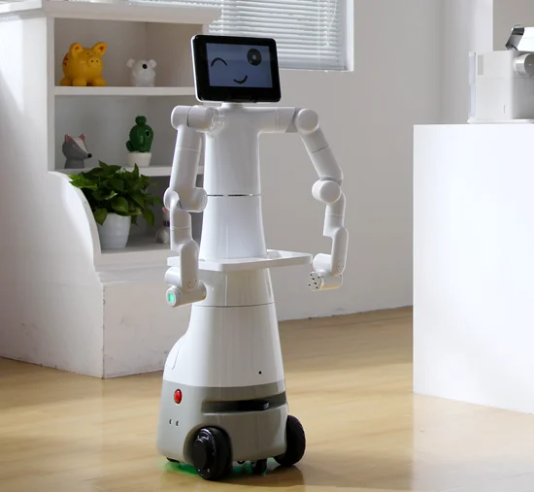
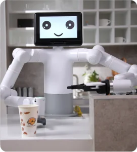

# Mercury_X1_Gitbook

欢迎来到Elephant Robotics水星系列的世界——这里，创新与实用性交织，为具身智能和人形机器人研究提供了一个前所未有的通用硬件平台。我们自豪地呈现三个独特的产品型号，每个都以其卓越的特性，满足您在机器人研究和教育领域的多样化需求。

**水星X1轮式人形机器人**：整机共19自由度，它结合了高性能移动底座与先进的双臂协同和感知能力，搭载英伟达Jetson边缘计算核心，和3D机器视觉，为机器人学和具身智能研究和开发提供了强大算力和硬件基础。

 
水星Mercury X1轮式人形机器人

**水星B1半人形机器人**：拥有17个自由度和双七轴机械臂，搭载英伟达Jetson边缘计算核心，3D机器视觉，和语音交互能力，是人机交互研究和双臂协同控制研究的首选。

 
水星Mercury B1半人形机器人

**水星A1七轴机械臂**：教育者的理想选择，这款7自由度的轻量级谐波关节机械臂，有效载荷1kg，可触摸的快速控制界面和应用软件极大简化了应用部署，无需复杂编程。

 
水星Mercury A1七轴机械臂

水星系列，不仅是机器人技术的集大成者，更是推动科学探索和教育创新的伙伴。

核心文档
---

本文档包含从产品简介、详细的技术参数到用户须知和首次安装指导的全面信息。我们将深入解释水星Mercury X1轮式人形机器人的基础功能，提供软件开发指南，并展示成功的应用案例，帮助您了解如何将 水星Mercury X1轮式人形机器人有效整合进各种应用中。此外，我们还提供了丰富的支持与服务信息，确保您在遇到任何技术挑战时能够获得必要的帮助。

文档说明
---

根据您的需求以及水星Mercury X1轮式人形机器人应用程序开发的专业水平，您可以选择从头到尾遵循该顺序，或将其用作独立参考。您可以随时使用左侧的侧边栏导航跳转到任何部分，全文共分为以下五大板块：

#### 产品简介
产品简介中产品信息板块将为您提供机械臂的基本概述，包括设计意图、主要功能和应用场景，帮助您快速了解产品的基本特性和使用环境。此外，这一部分将详细介绍产品的应用实例和支持的扩展开发，为您提供必要的开发指南和资源。文末将给出相关购买链接和渠道，方便您进行购买。
产品参数部分将向您展示包括机器规格、控制核心参数、结构尺寸和电气特性等详细的技术规格，这些信息对于理解产品的技术标准和性能指标至关重要。此外，还将提供关于机械臂工作范围和精确度的笛卡尔坐标系信息，为想要进行精密操作的用户提供参考。

#### 基础设置
本章节是使用本产品的每一位用户必须仔细阅读的重要部分。它涵盖了关于产品使用、运输、储存及维护的关键须知，旨在确保用户在操作产品时的安全性和效率。此外，本章节也详细说明了因未遵循这些指南而可能导致的产品故障或损害的责任划分。

#### 功能与应用
功能与应用板块详细介绍了机械臂的基础功能和软件使用方法，包括系统使用说明和固件功能。软件开发指南提供了基于不同开发环境的指导，如Python和ROS，支持技术开发者进行应用扩展。通过展示成功的应用案例和提供配套资源，为您提供实践参考和必要的支持材料，以便更深入地了解和使用产品。

#### 支持与服务
支持与服务板块将为您提供全面的故障排除指南和购买后的服务信息，如保修和服务条款，帮助您在遇到问题时能够快速解决，并确保您了解购买后的权利和义务。此外，'关于我们'部分加强了用户对Mercury系列产品设计及制造商的了解，旨在建立信任和品牌忠诚。

#### 致谢
我们非常感谢您花时间阅读水星Mercury X1轮式人形机器人用户手册。我们希望本文档能够帮助您更好地了解并有效使用这款机器人，从而激发您的创造力。如果您有任何疑问或需要进一步帮助，请随时联系我们的客户支持团队。我们期待看到您使用水星Mercury X1轮式人形机器人完成创新项目，并欢迎您加入我们快速发展的开发者社区。

---

# 文档目录

## 产品信息

* [1 产品介绍](1-ProductIntroduction/README.md)
* [2 产品参数](2-ProductFeature/README.md)

## 基础设置

* [3 用户须知](3-UserNotes/README.md)  
* [4 首次安装](4-FirstInstallAndUse/README.md)

## 功能与应用

* [5 软件开发指南](6-SDKDevelopment/README.md)
  * [5.1 基于Python 开发使用](6-SDKDevelopment/6.1-Python/README.md)
    * [1 API简介](6-SDKDevelopment/6.1-Python/6.1.2-ApplicationBasePython.md)
    * [2 python 案例](6-SDKDevelopment/6.1-Python/6.1.3-PythonDemo.md)
    * [3 拖动示教](6-SDKDevelopment/6.1-Python/6.1.4-Drag_teach.md)
  * [5.2 机器人操作系统 1 (ROS1) ](6-SDKDevelopment/6.2-ROS1/README.md)
    * [1 环境搭建](6-SDKDevelopment/6.2-ROS1/6.2.1-EnvironmentBuilding.md)
    * [2 ROS 基础](6-SDKDevelopment/6.2-ROS1/6.2.2-ROS_Basics.md)
    * [3 Rviz 使用](6-SDKDevelopment/6.2-ROS1/6.2.3-RvizIntroduction.md)
    * [4 基本功能案例](6-SDKDevelopment/6.2-ROS1/6.2.4-BasicFunction.md)
  * [5.3 机器人操作系统 2 (ROS2)](6-SDKDevelopment/6.3-ROS2/README.md)
    * [1 环境搭建](6-SDKDevelopment/6.3-ROS2/6.3.1-EnvironmentBuilding.md)
    * [2 ROS2 基础](6-SDKDevelopment/6.3-ROS2/6.3.2-ROS2_Basics.md)
    * [3 Rviz2 使用](6-SDKDevelopment/6.3-ROS2/6.3.3-Rviz2Introduction.md)
    * [4 基本功能案例](6-SDKDevelopment/6.3-ROS2/6.3.4-BasicFunction.md)
* [6 机器人使用场景](7-ExamplesRobotsUsing/README.md)
  * [6.1 二维码识别与抓取](7-ExamplesRobotsUsing/7.1-stag_detect.md) 
  * [6.2 空间移动案例](7-ExamplesRobotsUsing/7.2-robot_move.md) 
  * [6.3 多点位移动抓取案例](7-ExamplesRobotsUsing/7.3-move_and_catch.md) 
  
## 支持与服务

  * [7 关于我们](8-AboutUs/README.md)

## 致谢

  - [8 致谢](9-Acknowledgments/README.md)
