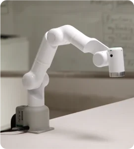

# Mercury_X1_Gitbook

---

Welcome to the world of Elephant Robotics' Mercury series, where innovation meets practicality, offering an unprecedented universal hardware platform for embodied intelligence and humanoid robot research. We proudly present three unique product models, each with its exceptional features to meet your diverse needs in robotics research and education.

**Mercury X1 Wheeled Humanoid Robot**: With 19 degrees of freedom, it combines a high-performance mobile base with advanced dual-arm coordination and perception capabilities, powered by the NVIDIA Jetson edge computing core and 3D machine vision, providing robust computing power and hardware foundation for robotics and embodied intelligence research and development.

 
Mercury X1 Wheeled Humanoid Robot

**Mercury B1 Semi-Humanoid Robot**: Featuring 17 degrees of freedom and dual seven-axis robotic arms, equipped with the NVIDIA Jetson edge computing core, 3D machine vision, and voice interaction capabilities, it is the first choice for human-robot interaction research and dual-arm coordination control research.

 
Mercury B1 Semi-Humanoid Robot

**Mercury A1 Seven-Axis Robotic Arm**: Ideal for educators, this 7-degree-of-freedom lightweight harmonic joint robotic arm has a payload of 1kg. Its touchable quick control interface and application software greatly simplify application deployment without complex programming.

 
Mercury A1 Seven-Axis Robotic Arm

The Mercury series is not only a culmination of robotic technology but also a partner in promoting scientific exploration and educational innovation.

---

## Core Documentation

This document includes comprehensive information from product introduction, detailed technical specifications to user notes and first installation guidance. We will delve into the basic functions of the Mercury X1 Wheeled Humanoid Robot, provide software development guides, and showcase successful application cases to help you effectively integrate the Mercury X1 Wheeled Humanoid Robot into various applications. Additionally, we offer rich support and service information to ensure you get the necessary help when facing any technical challenges.

## Document Instructions

Depending on your needs and the professional level of Mercury X1 Wheeled Humanoid Robot application development, you can choose to follow this sequence from start to finish or use it as a standalone reference. You can navigate to any section using the sidebar on the left. The document is divided into the following five main sections:

### Product Introduction
The product information section provides a basic overview of the robotic arm, including design intent, main functions, and application scenarios, helping you quickly understand the basic characteristics and usage environment of the product. Additionally, this section will detail application examples and supported extended development, providing necessary development guides and resources. At the end of the section, relevant purchase links and channels will be provided for your convenience.

### Basic Setup
This chapter is an important part that every user must read carefully. It covers key notes on product use, transportation, storage, and maintenance, aiming to ensure user safety and efficiency when operating the product. Additionally, this chapter details the responsibilities for product failures or damages caused by not following these guidelines.

### Functions and Applications
The functions and applications section details the basic functions of the robotic arm and software usage methods, including system usage instructions and firmware functions. The software development guide provides guidance based on different development environments, such as Python and ROS, supporting technical developers in application expansion. By showcasing successful application cases and providing supporting resources, it offers practical references and necessary support materials for a deeper understanding and use of the product.

### Support and Services
The support and services section provides comprehensive troubleshooting guides and post-purchase service information, such as warranty and service terms, helping you quickly resolve issues and ensuring you understand your rights and obligations after purchase. Additionally, the 'About Us' section enhances user understanding of the design and manufacturer of Mercury series products, aiming to build trust and brand loyalty.

### Acknowledgments
We greatly appreciate your time reading the Mercury X1 Wheeled Humanoid Robot user manual. We hope this document helps you better understand and effectively use this robot, inspiring your creativity. If you have any questions or need further assistance, please feel free to contact our customer support team. We look forward to seeing you complete innovative projects with the Mercury X1 Wheeled Humanoid Robot and welcome you to join our rapidly growing developer community.

---

# Table of Contents

## Product Information

* [1 Product Introduction](1-ProductIntroduction/README.md)
* [2 Product Specifications](2-ProductFeature/README.md)

## Basic Setup

* [3 User Notes](3-UserNotes/README.md)  
* [4 First Installation](4-FirstInstallAndUse/README.md)

## Functions and Applications

* [5 Software Development Guide](6-SDKDevelopment/README.md)
  * [5.1 Python](6-SDKDevelopment/6.1-Python/README.md)
    * [1 API Introduction](6-SDKDevelopment/6.1-Python/6.1.2-ApplicationBasePython.md)
    * [2 Python Examples](6-SDKDevelopment/6.1-Python/6.1.3-PythonDemo.md)
    * [3 Drag Teaching](6-SDKDevelopment/6.1-Python/6.1.4-Drag_teach.md)
  * [5.2 ROS1](6-SDKDevelopment/6.2-ROS1/README.md)
    * [1 Environment Setup](6-SDKDevelopment/6.2-ROS1/6.2.1-EnvironmentBuilding.md)
    * [2 ROS Basics](6-SDKDevelopment/6.2-ROS1/6.2.2-ROS_Basics.md)
    * [3 Using Rviz](6-SDKDevelopment/6.2-ROS1/6.2.3-RvizIntroduction.md)
    * [4 Basic Function Examples](6-SDKDevelopment/6.2-ROS1/6.2.4-BasicFunction.md)
  * [5.3 ROS2](6-SDKDevelopment/6.3-ROS2/README.md)
    * [1 Environment Setup](6-SDKDevelopment/6.3-ROS2/6.3.1-EnvironmentBuilding.md)
    * [2 ROS2 Basics](6-SDKDevelopment/6.3-ROS2/6.3.2-ROS2_Basics.md)
    * [3 Using Rviz2](6-SDKDevelopment/6.3-ROS2/6.3.3-Rviz2Introduction.md)
    * [4 Basic Function Examples](6-SDKDevelopment/6.3-ROS2/6.3.4-BasicFunction.md)
* [6 Robot Usage Scenarios](7-ExamplesRobotsUsing/README.md)
  * [6.1 QR Code Recognition and Grasping](7-ExamplesRobotsUsing/7.1-stag_detect.md) 
  * [6.2 Spatial Movement Case](7-ExamplesRobotsUsing/7.2-robot_move.md) 
  * [6.3 Multi-Point Movement and Grasping Case](7-ExamplesRobotsUsing/7.3-move_and_catch.md) 
  
## Support and Services

  * [7 About Us](8-AboutUs/README.md)

## Acknowledgments

  - [8 Acknowledgments](9-Acknowledgments/README.md)