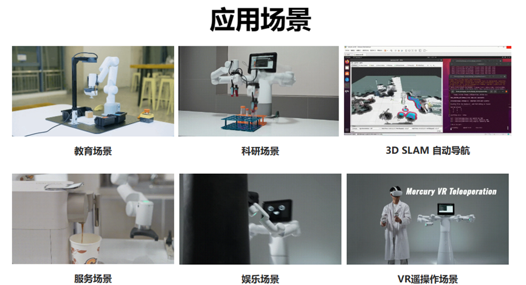

# 1 产品概述

## 产品简介
水星Mercury X1是一款面向具身智能应用的轮式双臂人形机器人共拥有19自由度，由水星Mercury B1双臂机器人和高性能移动底座组合而成。整机搭载全新自研力源系列谐波模组。全新模块化设计模组标配电磁制动刹车，中空走线。具有高精度、高惯量、低自重等特点。同时配备英伟达Jetson Xavier主控，与独立四个副控协同工作。移动底座配备高性能激光雷达，超声波传感器和2D视觉等丰富感知；采用直驱电机驱动，最大运行速度达1.2m/s； 最大爬坡高度2CM；最大爬坡角度15度。整机最大续航高达8小时，满足个人及商业应用的需求。

| 特征 | 描述 |
| --- | --- |
| 名称 | 水星Mercury X1 |
| 类型 | 轮式双臂人形机器人 |
| 自由度 | 19自由度 |
| 组成 | 水星Mercury B1双臂机器人 + 高性能移动底座 |
| 续航 | 最大8小时 |
| 应用 | 科研、教育、服务、娱乐、远程操作 |

## 设计理念

水星Mercury X1轮式人形机器人的设计理念源于对当前科技教育和研究领域需求的深刻理解。机器学习、人工智能等高科技领域快速发展，要求实验设备不仅要有通用功能性，还需具备灵活性和精确性。设计旨在满足这些复杂需求，提供一个既灵活精确又能适应各种应用场景的解决方案。

| 组件 | 功能 |
| --- | --- |
| 谐波模组 | 提供高精度、高惯量、低自重 |
| 中空走线 | 便于维护和升级 |
| 英伟达Jetson Xavier | 主控协同副控工作 |
| 激光雷达、超声波传感器、2D视觉 | 丰富感知能力 |
| 直驱电机 | 高性能驱动，最大速度1.2m/s |

## 设计目标

| 设计目标               | 描述                                                                                                                | 应用场景及特点                                                                           |
| ---------------------- | ------------------------------------------------------------------------------------------------------------------- | ---------------------------------------------------------------------------------------- |
| **通用多功能平台**     | 水星Mercury X1轮式人形机器人适用于教育、研究和商业展示等多种应用场景。                                                               | 其多自由度和 底盘移动导航支持在各种工作环境中执行复杂的运动控制，如精准定位和路径规划。  |
| **科研和教育支持**     | 水星Mercury X1轮式人形机器人特别适合机器学习和人工智能研究，能执行高精度的实验和技术演示。                                           | 支持端到端数据训练与复现，以及基础的视觉任务，是实验室中的理想设备。                     |
| **可编程性与扩展性**   | 水星Mercury X1轮式人形机器人的高度可编程性允许用户根据新兴技术自定义和编程，以适应未来技术的需求。                                   | 通过用户自定义编程，设备能实现优化操作和实验结果，满足研究与发展的不断变化。             |
| **技术创新与知识传播** | 水星Mercury X1轮式人形机器人在商业展示中可以作为展示最新科技成果的平台，旨在提高公众对科技的理解和兴趣，并推动科技创新向商业化转化。 | 通过展示和演示最新的科技成果，增加公众参与度，促进科技知识的普及和科技产品的市场接受度。 |

## 产品特点

| 特点 | 优势 |
| --- | --- |
| 高性能移动底座 | 爬坡能力强，移动灵活 |
| 长续航 | 满足长时间工作需求 |
| 多感知能力 | 环境适应性强 |
| 模块化设计 | 易于维护和升级 |

## 产品价值

| 价值 | 影响 |
| --- | --- |
| 教育与科研 | 促进智能机器人领域的教育和研究 |
| 商业服务 | 提升商业活动的互动性和效率 |
| 个人娱乐 | 丰富个人娱乐体验，激发创意 |

## 行业贡献

| 贡献 | 描述 |
| --- | --- |
| 科研工具 | 为人形机器人研究提供实验平台 |
| 教育资源 | 作为教学工具，培养机器人技术人才 |
| 服务创新 | 推动服务行业向智能化转型 |

## 产品应用

| 应用场景 | 功能 |
| --- | --- |
| 科研 | 双臂协同控制、运动规划 |
| 教育 | 图像识别、机器人控制教学 |
| 服务 | 展会服务、公司展示 |
| 娱乐 | 类人动作模拟 |
| 远程操作 | VR/Aloha遥控 |

## 3. 支持的扩展开发

水星Mercury X1轮式人形机器人在教育和科研领域中极具价值，特别是在 Python 和 ROS（Robot Operating System）这两个广泛使用的开发环境中。这些环境提供了强大的支持，使得 mercury 系列产品能够广泛应用于机器学习、人工智能研究、复杂运动控制以及视觉处理任务中。

|                |                                                                                                                                                                                                                                             |
| -------------- | ------------------------------------------------------------------------------------------------------------------------------------------------------------------------------------------------------------------------------------------- |
| **Python**     | - 提供标准化的机器人驱动库，可通过 PyPI 进行下载和安装 - 支持查询关节角度数据、笛卡尔坐标数据等 - 这些功能支持使得 mercury 适合于基本的教育和研究场景特别是在数据采集和初步机器人控制方面 |
| **ROS**        | - 支持 ROS1 和 ROS2 双版本，提供 RVIZ 仿真环境支持。 - 允许用户实时显示机械臂和采集机械臂的状态信息，使得 mercury 适合 ROS 初学者和教育用途。                                                                                               |
| **硬件接口**   | - 包括 IO、USB 等，方便连接各种传感器和执行器。                                                                                                                                                                                             |
| **软件库**     | - 提供丰富的开源库和 API 来简化开发过程。                                                                                                                                                                                                   |

---

[下一章 →](../2-ProductFeature/README.md)