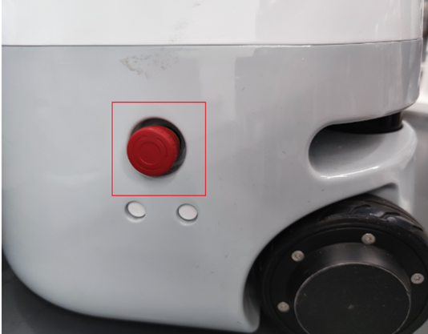

# 7 机器人使用场景案例

本章节呈现了经典的机械臂使用案例，以展示产品在富有代表性的场景中的应用。这包括了水星Mercury X1轮式人形机器人在不同领域的典型应用，突显了产品的多功能性和适用性。通过这些案例，用户可以深入了解机械臂在实际应用中的灵活性和效能，为他们在特定场景中的应用提供参考。

- [二维码识别与抓取](7.1-stag_detect.md) 
  在水星Mercury X1轮式人形机器人机械臂末端装上2D相机及夹爪实现视觉识别二维码抓取，二维码采用stag码，通过stag.detectMarkers函数获取stag码相机系的坐标，在通过矩阵变换获取stag码基于底座的坐标，调用坐标控制函数进行抓取。  

- [空间移动案例](7.2-robot_move.md) 
  可使用键盘对底盘进行遥控操作，也可可以调用mercury_ros_api库对底座进行移动控制及导航。

- [移动抓取案例](7.3-move_and_catch.md) 
  此案例将前两个案例结合起来，使用导航将水星Mercury X1轮式人形机器人移动至指定地点，然后通过视觉识别stag，实现抓取。

## 视觉识别功能使用前的准备

**1.物料及开机准备**

**1.1物料准备**

视觉识别跟踪需要准备的物料包括：
1)	Mercury系列水星机器
2)	视觉传感器及stag码配件
3)	夹爪及相关配件

**1.2开机准备**
  
将电源适配器连接上机械臂，也可通过内置电源供电，并将机器人移至空旷区域防止碰撞。

底座后部电源接口位置

电源开关位置
 

急停开关位置

在按下急停开关后机器人将立即停止运动，复位时需将急停开关顺时针旋转，急停开关将自动弹起，之后可上电恢复控制。

点击电源开关，并确保急停处于复位状态，开始使用机械臂。

**2.Mercury整机调试**

**2.1整机上电**

机械臂支持多种方式上电，本文仅介绍使用python指令控制上电，在Terminal终端中输入下述指令使机器人上电：

    python
    from pymycobot import Mercury
    mr = Mercury("/dev/right_arm")  #connect to Mercury right arm
    ml = Mercury("/dev/left_Arm")  #connect to Mercury left arm
    ml.power_on()	
    mr.power_on()	

发送指令前，确保急停开关处于复位状态，当听到**关节抱闸声**则代表上电成功！若未听到抱闸声，使用以下指令反复上下电：

首先发送掉电指令

    ml.power_off()	
    mr.power_off()	

等待数秒后发送上电指令

    ml.power_on()	
    mr.power_on()	

**若仍未听到抱闸声，联系工程师进行处理。**

**2.2机械臂零点校准**

机械臂使用前，需确保零位正确，可以通过下述方法校准零位：

1）使用放松指令释放关节电机（**注意！放松后需要扶住关节防止机械臂下坠损坏！**）

    ml.release_all_servos()
    mr.release_all_servos()

2）拖动机械臂回到零位

可以通过以下细节确定零点的位置
 
 

3）发送指令锁闭电机

    ml.focus_all_servos()
    mr.focus_all_servos()
 	
4）检查零点是否正确

输入获取关节角度指令查询当前位置

    ml.get_angles()
    mr.get_angles()

如果返回的关节角度逼近[0, 0, 0, 0, 90, 0]，则视为零点正确

5）零点校准

如果在零位读取到的关节角度与[0, 0, 0, 0, 90, 0]相差很大，则需要校准关节零位

    for i in range(1,7):
      ml.set_servo_calibration(i)
      mr.set_servo_calibration(i)

校准完毕后读取关节信息，返回为[0, 0, 0, 0, 90, 0]则表示校准成功

    ml.get_angles()
    mr.get_angles()

**2.3机械臂运动**

可以通过以下方式验证机械臂运动功能是否正常：

1)确保零点正确后，使用回零指令即可控制机械臂回到零位:

    ml.over_limit_return_zero()
    mr.over_limit_return_zero()
 
2)发送关节运动指令，验证机械臂运动是否正常

    ml.send_angle(1,20,10)
    mr.send_angle(1,20,10)

此时应可观测到机械臂1关节发生旋转，待运动结束后使用指令读取关节信息

    ml.get_angles()
    mr.get_angles()
若返回值中1关节为20°，则视为运动正常

**2.4异常处理**

	若2.3中机械臂运动异常，使用以下方法观察异常信息

1)获取电机异常信息

    ml.get_robot_status()
    mr.get_robot_status()

2）获取运动异常信息

    ml.get_error_information()
    mr.get_error_information()

**将上述接口的返回信息交付工程师处理**

**3.相机和夹爪的安装方法**

相机和夹爪的安装方式与视觉识别的手眼矩阵相对应，若安装方式改变则需重新进行手眼标定！

首先将机械臂移动回零点：

    ml.over_limit_return_zero()
    mr.over_limit_return_zero()

对照下图进行夹爪和相机的安装

  
**4.相机参数配置**

**4.1	查找相机编号**

由于Mercury水星存在多个视觉传感器，在进行相机参数配置前，首先需要找到左右臂相机对应的编号：

1)首先进行相机初始化，在Camera_ID处依次填入0~6数字

#### `obj = camera_detect(Camera_ID = 0, mark_size, mtx, dist, direction)`

#### `obj = camera_open_loop()`
开启相机，观测相机画面，标记该相机对应的编号,如果相机无法开启，修改Camera_ID并重复该操作

2)修改Camera_ID，按照步骤1依次记录相机编号

#### `obj = camera_detect(Camera_ID = 1, mark_size, mtx, dist, direction)`

#### `obj = camera_open_loop()`

3)将左右臂相机对应的编号修改到py脚本的下述位置即可
#### `ml_obj = camera_detect(Camera_ID = left, mark_size, mtx, dist, direction)`

#### `mr_obj = camera_detect(Camera_ID = right, mark_size, mtx, dist, direction)`

**4.2	相机内参标定**

**5.夹爪功能调试**

使用以下接口进行夹爪零点校准：

1）夹爪初始化

    ml.set_gripper_mode(0)
    mr.set_gripper_mode(0)

2）放松夹爪

    ml.set_gripper_enabled(0)
    mr.set_gripper_enabled(0)

手动张开夹爪至最大

3）设置夹爪零位

    ml.set_gripper_calibration()
    mr.set_gripper_calibration()
 
4）控制夹爪闭合

    ml.set_gripper_value(0,100)
    mr.set_gripper_value(0,100)

此时应能观察到夹爪快速闭合

夹爪异常排查：

1)	夹爪无法运动——重复1~4步骤，**若仍然无法运动，联系我方工程师**
2)	步骤4未完全合拢——步骤2中，不要张至最大，然后设置零点

**6.整机综测**

执行下述py脚本，应观察到以下现象：

1)	机械臂回到零位
2)	夹爪打开后闭合
3)	机械臂运动到如下位置
4)	夹爪开合

若现象与上述情况不符，重复测试运动测试、夹爪测试章节 

    from pymycobot import *
    import numpy as np
    import time

    mr = Mercury("/dev/right_arm")  #connect to Mercury right arm
    ml = Mercury("/dev/left_Arm")  #connect to Mercury left arm

    ml.over_limit_return_zero()
    mr.over_limit_return_zero()
    time.sleep(10)

    ml.set_gripper_mode(0)
    mr.set_gripper_mode(0)
    time.sleep(1)
    ml.set_gripper_value(100,10)
    mr.set_gripper_value(100,10)
    time.sleep(3)
    ml.set_gripper_value(0,10)
    mr.set_gripper_value(0,10)
    time.sleep(3)

    ml.send_angles([45, 20, -45, 45, 120, 45], 10)
    mr.send_angles([-45, 20, 45, 45, 120, -45], 10)
    time.sleep(5)
    la = ml.get_angles()
    ra = mr.get_angles()
    print("left", la)
    print("right", ra)

    ml.set_gripper_value(100,10)
    mr.set_gripper_value(100,10)
    time.sleep(3)
    ml.set_gripper_value(0,10)
    mr.set_gripper_value(0,10)
    time.sleep(3)

[← 上一章](../6-SDKDevelopment/README.md) | [下一页 →](../7-ExamplesRobotsUsing/7.1-stag_detect.md)